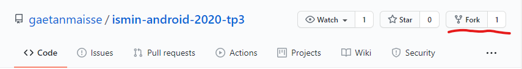
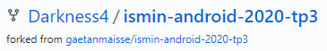
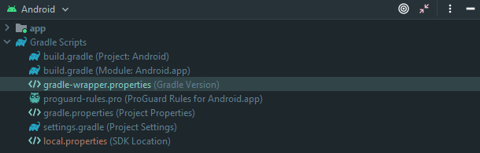
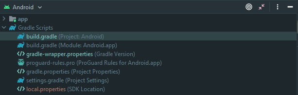
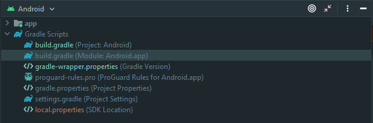
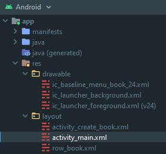
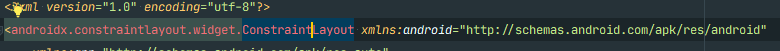
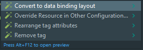

# Exercice : Migration vers MVVM

## Tâche : [DataBinding](https://developer.android.com/topic/libraries/data-binding)

### Préparation

Pour éviter de travailler sur le dépôt distant de gaetanmaisse, il est recommandée de Fork & Clone au lieu de Cloner directement le dépôt distant du professeur. Cela permet d'avoir notre propre dépôt distant tout en suivant le dépôt du professeur.

Pour cela :

Forkez le dépôt [gaetanmaisse/ismin-android-2020-tp3](https://github.com/gaetanmaisse/ismin-android-2020-tp3) et mettez-le dans votre compte. :



Vous êtes censé obtenir ceci (Darkness4 étant mon compte) :



Clonez ce dépot.

```sh
# Avec SSH
git clone git@github.com:[votre-compte]/ismin-android-2020-tp3.git
# Avec HTTPS
git clone https://github.com/[votre-compte]/ismin-android-2020-tp3.git
```

Lorsque vous aurez terminé une tache, n'oubliez pas de `git add . && git commit -m "Tache X terminé"` et `git push`.

Cela permettra de sauvegarder votre progression en cas de problème.

<div style="page-break-after: always; break-after: page;"></div>

### Activez le Android [DataBinding](https://developer.android.com/topic/libraries/data-binding)

Ouvrez le projet avec Android Studio.

Pour éviter des problèmes de compatibilité avec ce cours, nous allons mettre à jour Gradle et son plugin.

1. Modifiez le `./gradle/wrapper/gradle-wrapper.properties` :

   

2. Et pour `distributionUrl`, nous utiliserons `https\://services.gradle.org/distributions/gradle-6.6.1-bin.zip`.

   ```properties
   #Sun Sep 27 11:30:07 CEST 2020
   distributionBase=GRADLE_USER_HOME
   distributionPath=wrapper/dists
   zipStoreBase=GRADLE_USER_HOME
   zipStorePath=wrapper/dists
   distributionUrl=https\://services.gradle.org/distributions/gradle-6.6.1-bin.zip
   ```

3. Modifiez ensuite le `build.gradle` **au niveau du projet** :

   

   Mettez à jour le plugin en remplaçant `classpath "com.android.tools.build:gradle:4.0.1"` par `classpath "com.android.tools.build:gradle:4.1.0"`.

   ```groovy
   // Top-level build file where you can add configuration options common to all sub-projects/modules.
   buildscript {
       ext.kotlin_version = "1.4.10"
       repositories {
           google()
           jcenter()
       }
       dependencies {
           classpath 'com.android.tools.build:gradle:4.1.0'
           classpath "org.jetbrains.kotlin:kotlin-gradle-plugin:$kotlin_version"

           // NOTE: Do not place your application dependencies here; they belong
           // in the individual module build.gradle files
       }
   }

   allprojects {
       repositories {
           google()
           jcenter()
       }
   }

   task clean(type: Delete) {
       delete rootProject.buildDir
   }
   ```

4. Modifiez ensuite le `build.gradle` au niveau du module `app` :

   

   Nous allons utiliser les dernières normes de Gradle, mettre à jour les dépendances et ajouter le [DataBinding](https://developer.android.com/topic/libraries/data-binding) :

   - Remplacez :

     ```groovy
     apply plugin: 'com.android.application'
     apply plugin: 'kotlin-android'
     apply plugin: 'kotlin-android-extensions'
     ```

     Par :

     ```groovy
     plugins {
         id 'com.android.application'
         id 'kotlin-android'
         id 'kotlin-android-extensions'
         id 'kotlin-kapt'  // On en aura besoin pour traiter les annotations
     }
     ```

     Il s'agit du nouveau style pour appliquer des plugins Gradle. Voir [docs.gradle.org/current/userguide/plugins.html](https://docs.gradle.org/current/userguide/plugins.html) pour plus d'informations.

   - Suivez les recommandations d'Android Studio et mettez à jour `buildToolsVersion` et les `dependencies`.

     ```groovy
     android {
         compileSdkVersion 30
         buildToolsVersion "30.0.2"
         // ...
     }

     dependencies {
         implementation fileTree(dir: "libs", include: ["*.jar"])
         implementation "org.jetbrains.kotlin:kotlin-stdlib:$kotlin_version"
         implementation 'androidx.core:core-ktx:1.3.2'  // Up
         implementation 'androidx.appcompat:appcompat:1.2.0'
         implementation 'androidx.constraintlayout:constraintlayout:2.0.2'  // Up
         implementation 'androidx.recyclerview:recyclerview:1.1.0'
         testImplementation 'junit:junit:4.13'  // Up
         androidTestImplementation 'androidx.test.ext:junit:1.1.2'
         androidTestImplementation 'androidx.test.espresso:espresso-core:3.3.0'
     }
     ```

   - Activez le [DataBinding](https://developer.android.com/topic/libraries/data-binding) en ajoutant :

     ```groovy
     android {
         compileSdkVersion 30
         buildToolsVersion "30.0.2"

         buildFeatures {
             dataBinding true
         }

         // ...
     }
     ```

5. Synchronisez Gradle :

   

### Transformez les layout xml en layout pouvant supporter le [DataBinding](https://developer.android.com/topic/libraries/data-binding)

Actuellement, toutes les vues utilisent `findViewById`. Cette fonction est actuellement pesante en terme de complexité. Pour éviter cela, on utilise le DataBinding.

Manuellement et en utilisant les fonctions de Kotlin, cela prend sous cette forme :

```kotlin
// Original

class MainActivity : AppCompatActivity() {
    // ...

    private lateinit var rcvBooks: RecyclerView

    // ...

    override fun onCreate(savedInstanceState: Bundle?) {
        super.onCreate(savedInstanceState)
        setContentView(R.layout.activity_main)

        // ...

        this.rcvBooks = findViewById(R.id.a_main_rcv_books)

        // ...
    }

    // ...
}
```

```kotlin
// Avec kotlin

class MainActivity : AppCompatActivity() {
    // ...

    private val rcvBooks by lazy<RecyclerView> { findViewById(R.id.a_main_rcv_books) }
    private val bookAdapter: BookAdapter

    override fun onCreate(savedInstanceState: Bundle?) {
        super.onCreate(savedInstanceState)
        setContentView(R.layout.activity_main)

        // ...
    }

    // ...
}
```

Cette méthode est valable mais :

1. Cela ne marche que sur Kotlin
2. `findViewById` n'est pas _null-safe_. Il est possible d'obtenir un _NullPointerException_ si le `R.id.a_main_rcv_books` n'est pas le bon.
3. `findViewById` n'est pas _type-safe_. Rien ne dit que `R.id.a_main_rcv_books` est actuellement un `RecyclerView`.

D'autres solutions ont existé pour résoudre ce problème comme :

- [Butter Knife](https://jakewharton.github.io/butterknife/)
- Kotlin Synthetic
- Android [ViewBinding](https://developer.android.com/topic/libraries/view-binding)

Cependant, chacun de ces projets ont été déprécié pour supporter soit `findViewById` ou Android [ViewBinding](https://developer.android.com/topic/libraries/view-binding).

Nous allons donc utiliser **Android [DataBinding](https://developer.android.com/topic/libraries/data-binding)** qui inclus ViewBinding (xml vers vue) mais permet également de transférer des données dans les XML.

La différence la plus flagrante est le fait que nous devons convertir les layouts en layout compatible avec DataBinding pour générer les classes qui permettront de lier les données. En effet, avec ViewBinding, toutes les layouts génèrent automatiquement une classe pour le Binding.

**Commençons par le `activity_main.xml` :**



- Placez le curseur sur le layout racine.

  

- `ALT` + `ENTER` ou appuyez sur l'ampoule  et faites `Convert to data binding layout` :

  

  Vous obtenez :

  ```xml
  <?xml version="1.0" encoding="utf-8"?>
  <layout xmlns:android="http://schemas.android.com/apk/res/android"
      xmlns:app="http://schemas.android.com/apk/res-auto"
      xmlns:tools="http://schemas.android.com/tools">

      <data>

      </data>

      <androidx.constraintlayout.widget.ConstraintLayout
          android:layout_width="match_parent"
          android:layout_height="match_parent"
          tools:context=".MainActivity">

          <androidx.recyclerview.widget.RecyclerView
              android:id="@+id/a_main_rcv_books"
              android:layout_width="0dp"
              android:layout_height="0dp"
              app:layout_constraintBottom_toBottomOf="parent"
              app:layout_constraintEnd_toEndOf="parent"
              app:layout_constraintStart_toStartOf="parent"
              app:layout_constraintTop_toTopOf="parent"
              tools:itemCount="10"
              tools:listitem="@layout/row_book" />

          <Button
              android:id="@+id/a_main_btn_creation"
              android:layout_width="wrap_content"
              android:layout_height="wrap_content"
              android:onClick="goToCreation"
              android:text="Creation"
              app:layout_constraintBottom_toBottomOf="parent"
              app:layout_constraintEnd_toEndOf="parent" />
      </androidx.constraintlayout.widget.ConstraintLayout>
  </layout>
  ```

  Un layout compatible avec le DataBinding contient une balise `<data>` et une balise layout racine.

  La classe généré se nomme en fonction du fichier xml, soit `ActivityMainBinding`.

- Allons au `MainActivity.kt`.

  Maintenant que nous avons activé le binding, l'objectif est d'éliminer tout apparition de `R.[ressources]` et `findViewById`.

  - Ajoutez `private lateinit var binding: ActivityMainBinding` au niveau de la classe, à coté de `private lateinit var rcvBooks: RecyclerView`.

  - Bindez en ajoutant dans la méthode `onCreate` : `binding = ActivityMainBinding.inflate(layoutInflater)`

    ```kotlin
    override fun onCreate(savedInstanceState: Bundle?) {
        super.onCreate(savedInstanceState)
        binding = ActivityMainBinding.inflate(layoutInflater)
        // ...
    }
    ```

    `ActivityMainBinding.inflate` permet de lier l'XML à l'objet `ActivityMainBinding`. Le `layoutInflater` permet de lier l'XML à une View.

  - Remplaçons donc `setContentView(R.layout.activity_main)` par la vue root, soit :

    ```kotlin
    override fun onCreate(savedInstanceState: Bundle?) {
        super.onCreate(savedInstanceState)
        binding = ActivityMainBinding.inflate(layoutInflater)
        setContentView(binding.root)
        // ...
    }
    ```

  - Nous pouvons maintenant supprimer ces lignes :

    ```kotlin
    class MainActivity : AppCompatActivity() {
        /...

        private lateinit var rcvBooks: RecyclerView  // Supprimer
        private lateinit var binding: ActivityMainBinding

        override fun onCreate(savedInstanceState: Bundle?) {
            super.onCreate(savedInstanceState)
            binding = ActivityMainBinding.inflate(layoutInflater)
            setContentView(binding.root)

            // ...

            this.rcvBooks = findViewById(R.id.a_main_rcv_books) // delete

            // ...
        }

        // ...
    }
    ```

  - Supprimez toute les référence de `rcvBooks` par `binding.aMainRcvBooks`.

**Faites de même pour toutes les views (BookViewHolder et CreateBookActivity)**

<details>
<summary>Solution CreateBookActivity</summary>

```kotlin
// CreateBookActivity.kt
class CreateBookActivity : AppCompatActivity() {
    private lateinit var binding: ActivityCreateBookBinding

    override fun onCreate(savedInstanceState: Bundle?) {
        super.onCreate(savedInstanceState)
        binding = ActivityCreateBookBinding.inflate(layoutInflater)
        setContentView(binding.root)
    }

    fun saveBook(view: View) {
        val title = binding.aCreateBookEdtTitle.text.toString();
        val author = binding.aCreateBookEdtAuthor.text.toString();
        val date = binding.aCreateBookEdtDate.text.toString();

        val book = Book(title, author, date)
        val intent = Intent()
        intent.putExtra(CREATED_BOOK_EXTRA_KEY, book)
        setResult(RESULT_OK, intent)
        finish()
    }
}
```

</details>

<details>
<summary>Solution BookViewHolder</summary>

```kotlin
// BookViewHolder.kt
class BookViewHolder(binding: RowBookBinding) : RecyclerView.ViewHolder(binding.root) {
    var txvTitle = binding.rBookTxvTitle
    var txvAuthor: TextView = binding.rBookTxvAuthor
    var txvDate: TextView = binding.rBookTxvDate
}
```

```kotlin
// BookAdapter.kt
class BookAdapter(private val books: ArrayList<Book>) : RecyclerView.Adapter<BookViewHolder>() {
    override fun onCreateViewHolder(parent: ViewGroup, viewType: Int): BookViewHolder {
        val binding = RowBookBinding.inflate(LayoutInflater.from(parent.context), parent, false)
        return BookViewHolder(binding)
    }

    override fun onBindViewHolder(holder: BookViewHolder, position: Int) {
        val (title, author, date) = books[position]

        holder.txvTitle.text = title
        holder.txvAuthor.text = author
        holder.txvDate.text = date
    }

    override fun getItemCount(): Int {
        return books.size
    }

    fun refreshData(updatedBooks: java.util.ArrayList<Book>) {
        books.clear()
        books.addAll(updatedBooks)
    }
}
```

Mais on peut mieux faire !

```kotlin
// BookViewHolder.kt
class BookViewHolder(val binding: RowBookBinding) : RecyclerView.ViewHolder(binding.root)
```

```kotlin
// BookAdapter.kt
class BookAdapter(private val books: ArrayList<Book>) : RecyclerView.Adapter<BookViewHolder>() {
    override fun onCreateViewHolder(parent: ViewGroup, viewType: Int): BookViewHolder {
        val binding = RowBookBinding.inflate(LayoutInflater.from(parent.context), parent, false)
        return BookViewHolder(binding)
    }

    override fun onBindViewHolder(holder: BookViewHolder, position: Int) {
        val (title, author, date) = books[position]

        holder.binding.rBookTxvTitle.text = title
        holder.binding.rBookTxvAuthor.text = author
        holder.binding.rBookTxvDate.text = date
    }

    override fun getItemCount(): Int {
        return books.size
    }

    fun refreshData(updatedBooks: java.util.ArrayList<Book>) {
        books.clear()
        books.addAll(updatedBooks)
    }
}
```

`BookViewHolder.kt` fait littéralement une ligne. Autant le déplacer dans BookAdapter en tant que classe interne...

```kotlin
// BookAdapter.kt
class BookAdapter(private val books: ArrayList<Book>) : RecyclerView.Adapter<BookAdapter.ViewHolder>() {
    class ViewHolder(val binding: RowBookBinding) : RecyclerView.ViewHolder(binding.root)

    override fun onCreateViewHolder(parent: ViewGroup, viewType: Int): ViewHolder {
        val binding = RowBookBinding.inflate(LayoutInflater.from(parent.context), parent, false)
        return ViewHolder(binding)
    }

    override fun onBindViewHolder(holder: ViewHolder, position: Int) {
        val (title, author, date) = books[position]

        holder.binding.rBookTxvTitle.text = title
        holder.binding.rBookTxvAuthor.text = author
        holder.binding.rBookTxvDate.text = date
    }

    override fun getItemCount(): Int {
        return books.size
    }

    fun refreshData(updatedBooks: java.util.ArrayList<Book>) {
        books.clear()
        books.addAll(updatedBooks)
    }
}
```

Maintenant, on aimerait bien que `val binding: RowBookBinding` de `ViewHolder` soit `private` et au lieu de `holder.binding.XXX = YYY`, on regroupe tout ça dans une seule méthode `bind`.

En réglant les problèmes d'interfaces, voici, au mieux, ce que vous pouvez obtenir :

```kotlin
// BookAdapter
class BookAdapter(private val books: MutableList<Book>) :
    RecyclerView.Adapter<BookAdapter.ViewHolder>() {
    class ViewHolder(private val binding: RowBookBinding) : RecyclerView.ViewHolder(binding.root) {
        fun bind(item: Book) {
            binding.rBookTxvTitle.text = item.title
            binding.rBookTxvAuthor.text = item.author
            binding.rBookTxvDate.text = item.date
            binding.executePendingBindings()  // Forcer le binding
        }
    }

    override fun onCreateViewHolder(parent: ViewGroup, viewType: Int) =
        ViewHolder(RowBookBinding.inflate(LayoutInflater.from(parent.context), parent, false))

    override fun onBindViewHolder(holder: ViewHolder, position: Int) = holder.bind(books[position])

    override fun getItemCount() = books.size

    fun refreshData(updatedBooks: MutableList<Book>) {
        books.clear()
        books.addAll(updatedBooks)
    }
}
```

</details>

Cool, on a réduit toute ces lignes et assuré le _type-safety_.

**Et le "Data"Binding dans tout ça ?**

Vous devez bien vous imaginez que `binding.rBookTxvTitle.text = item.title` est un peu pénible et que la balise `data` sert à quelque chose.

En effet, nous allons faire passer les données directement dans la balise `data`.

Par exemple, pour le `BookAdapter`, l'objectif serait de faire passer directement `Book`.

### Utilisez le DataBinding pour faire passer les données

Si on avait :

```kotlin
findViewById<TextView>(R.id.sample_text).apply {
    text = viewModel.userName
}
```

On aimerait plutôt que sur l'XML, on fait simplement :

```xml
<TextView
    android:text="@{viewmodel.userName}" />
```

**Modifions donc `row_book.xml`**

Remplacez la balise `data` par :

```xml
    <data>
        <variable
            name="book"
            type="com.ismin.android.Book" />
    </data>
```

Et ajoutez :

```xml
android:text="@{book.XXX}"
```

dans les balise correspondante.

Soit :

```xml
<layout>
    <data>
        <variable
            name="book"
            type="com.ismin.android.Book" />
    </data>

    <androidx.constraintlayout.widget.ConstraintLayout>

        <TextView
            android:id="@+id/r_book_txv_title"
            android:text="@{book.title}" />

        <TextView
            android:id="@+id/r_book_txv_author"
            android:text="@{book.author}" />

        <TextView
            android:id="@+id/r_book_txv_date"
            android:text="@{book.author}" />

        <ImageView />
    </androidx.constraintlayout.widget.ConstraintLayout>
</layout>
```

**Revenons dans le `BookAdapter.kt`**

Remplacez :

```kotlin
fun bind(item: Book) {
    binding.rBookTxvTitle.text = item.title
    binding.rBookTxvAuthor.text = item.author
    binding.rBookTxvDate.text = item.date
    binding.executePendingBindings()
}
```

Par :

```kotlin
fun bind(item: Book) {
    binding.book = item
    binding.executePendingBindings()
}
```

**Testez.**

### Conclusion

Cool. Vous avez mis en place le DataBinding. Cependant, cela ne touche qu'une légère partie du MVVM.

Dans le modèle MVVM, il y a un binding entre View et ViewModel. Ce binding est actuellement bidirectionnel, donc, normalement, lorsque l'on exécute `saveBook`, nous n'avons pas à aller chercher la donnée :

```kotlin
fun saveBook(view: View) {
    val title = binding.aCreateBookEdtTitle.text.toString();  // Ceci n'est pas bon
    val author = binding.aCreateBookEdtAuthor.text.toString();
    val date = binding.aCreateBookEdtDate.text.toString();

    val book = Book(title, author, date)
    val intent = Intent()
    intent.putExtra(CREATED_BOOK_EXTRA_KEY, book)
    setResult(RESULT_OK, intent)
    finish()
}
```

De plus, de nombreuse opération sont liés au Lifecycle de la View. Rien que le fait d'éteindre l'écran cela demande de gérer [onSaveInstanceState()](<https://developer.android.com/reference/android/app/Activity#onSaveInstanceState(android.os.Bundle)>).

De même, on aimerait éviter que la View modifie directement le Model en passant par le Controller.

L'objectif de la tâche suivant sera d'implémenter un ViewModel et d'éviter d'utiliser la plupart des fonctions de Lifecycle.

N'oubliez de `commit` et également `push`.

## Tâche : ViewModel

### App Architecture

[App Architecture](https://developer.android.com/jetpack/guide) définissent le comportement et les relations entre chaque classes.

Sur Android, l'App Architecture se base sur :

- La séparation des préoccupations/responsabilités (**Séparations of concerns**)
- **L'UI se base sur le Model.** Le model est **indépendante** à l'application, c'est-à-dire, que même si l'application fonctionne mal, cela n'affecte pas les données. Exemple 1 : Tuer une application ne fait pas perdre de données utilisateurs. Exemple 2 : L'application fonctionne même s'il n'y a pas de connexion à Internet.

Google suggère d'utiliser l'architecture suivante :


L'objectif à la fin de ce tutoriel sera d'arriver à mettre en place les `ViewModel` et des `ViewModelFacotry`.

Rappelons quelque définition avant de commencer :

- Un **UI Controller** est une classe basée sur l'UI telle que `Activity ` ou `Fragment`. Un **UI Controller** ne doit contenir que la logique qui gère les interactions entre l'interface utilisateur et le système d'exploitation, comme l'affichage des vues et la saisie des données de l'utilisateur. Ne placez pas de logique décisionnelle, telle que la logique qui détermine le texte à afficher, dans le contrôleur d'interface utilisateur.
- Un [**`ViewModel`**](https://developer.android.com/reference/android/arch/lifecycle/ViewModel) contient des données à afficher dans un fragment ou une activité associée au `ViewModel`. Un `ViewModel` peut effectuer des calculs et des transformations simples sur les données afin de préparer les données à afficher par le UI Controller. Dans cette architecture, le ViewModel prend les décisions.


### Préparation

- Ajoutez les dépendances suivantes dans `gradle.build` dans le module `app` :

  ```groovy
  // Lifecycle
  def lifecycle_version = '2.2.0'
  implementation "androidx.lifecycle:lifecycle-livedata-ktx:$lifecycle_version"
  implementation "androidx.lifecycle:lifecycle-viewmodel-ktx:$lifecycle_version"

  // Activity
  implementation "androidx.activity:activity-ktx:1.1.0"
  // Fragment
  implementation "androidx.fragment:fragment-ktx:1.2.5"
  ```

  Les deux premiers permettent l'utilisation de `LiveData` et `ViewModel` avec les extensions KTX.

  Les deux dernières permettent d'injecter un `ViewModel` dans un `Fragment` ou `Activity`.

- Pour éviter les erreurs de compilation, ajoutez également :

  ```groovy
  android {
      // ...

      buildTypes {
          // ...
      }
      // Ici
      compileOptions {
          sourceCompatibility JavaVersion.VERSION_1_8
          targetCompatibility JavaVersion.VERSION_1_8
      }
      kotlinOptions {
          jvmTarget = '1.8'
      }
  }
  ```

**Synchronisez Gradle.**

### MainViewModel

Faites un ViewModel dans un nouveau fichier `MainViewModel.kt` :

```kotlin
import androidx.lifecycle.ViewModel

class MainViewModel: ViewModel() {
}
```

Faisons le binding côté `MainActivity` :

- Ajoutez le `ViewModel` au `MainActivity` au niveau de la classe :

  ```kotlin
  class MainActivity : AppCompatActivity() {
      private val viewModel by viewModels<MainViewModel>()  // Ici
      private lateinit var binding: ActivityMainBinding
      // ...
  }
  ```

  Désormais, le `ViewModel` est instancié et suit le lifecycle de l'`Activity` :

  

- Mettez le `ViewModel` dans l'XML :

  ```xml
  <data>
      <variable
                name="viewModel"
                type="com.ismin.android.MainViewModel" />
  </data>
  ```

  ```kotlin
  // MainActivity.kt
  override fun onCreate(savedInstanceState: Bundle?) {
      super.onCreate(savedInstanceState)
      binding = ActivityMainBinding.inflate(layoutInflater)
      binding.viewModel = viewModel  // Ici
      setContentView(binding.root)
      // ...
  }
  ```

Déplaçons le "Model" dans le `ViewModel`, soit, déplaçons `bookshelf` dans le `ViewModel` ainsi que les opérations `getAllBooks` et `addBook` :

```kotlin
class MainViewModel: ViewModel() {
    private val bookshelf = Bookshelf()
    private val theLordOfTheRings = Book(
        title = "The Lord of the Rings",
        author = "J. R. R. Tolkien",
        date = "1954-02-15"
    )
    private val theHobbit = Book(
        title = "The Hobbit",
        author = "J. R. R. Tolkien",
        date = "1937-09-21"
    )
    private val aLaRechercheDuTempsPerdu = Book(
        title = "À la recherche du temps perdu",
        author = "Marcel Proust",
        date = "1927"
    )

    init {
        bookshelf.addBook(theLordOfTheRings)
        bookshelf.addBook(theHobbit)
        bookshelf.addBook(aLaRechercheDuTempsPerdu)
    }

    fun addBook(book: Book) = bookshelf.addBook(book)

    fun getAllBooks() = bookshelf.getAllBooks()
}
```

Par conséquent, dans `MainActivity`, remplacez les `bookshelf.[méthode]` par `viewModel.[méthode]`.

Dans `MainActivity`, voici les actions des utilisateurs qui modifie le comportement de l'application :

- `goToCreation`
- `onActivityResult`

Actuellement, `onActivityResult` ne pose plus de problème (mis à part qu'il faut appeler manuellement `refreshData` et `notifyDataSetChanged`, cependant, nous mettrons à jour ultérieurement).

Par contre, `goToCreation` est une méthode de l'UI Controller qui est appelé par une Vue. Ce n'est pas le comportement voulu ! On souhaite que la Vue appelle le ViewModel.

Pour régler cela, nous allons utiliser un [`LiveData`](https://developer.android.com/topic/libraries/architecture/livedata). `LiveData` est une classe dans lequel ses changements sont observables. En clair, nous pouvons observer les changements du `LiveData` avec un `Observer` et exécuter une méthode lorsqu'il y a un évènement.

`LiveData` est extrêmement puissant, car il est également lié au lifecycle.

Pour cela, modifiez le `MainActivity` et liez le `binding.lifecycleOwner` à l'UI Controller :

```kotlin
override fun onCreate(savedInstanceState: Bundle?) {
    super.onCreate(savedInstanceState)
    binding = ActivityMainBinding.inflate(layoutInflater)
    binding.viewModel = viewModel
    binding.lifecycleOwner = this  // Ici
    setContentView(binding.root)
}
```

Maintenant, ajoutons des `LiveData` au `ViewModel`.

**Nous allons ajouter un `LiveData` qui observe l'action `goToCreation`**

Pour cela, on instancie un `MutableLiveData` dans le `ViewModel` :

```kotlin
val goToCreation = MutableLiveData<Unit?>(null)
```

`MutableLiveData` permet de modifier la valeur du `LiveData` (par exemple, `goToCreation.value = Unit`) et hérite de `LiveData`. `LiveData` ne peut pas modifier sa donnée.

Pour éviter des problèmes de sécurité, nous allons limiter l'accès en utilisant des getters et setters.

```kotlin
// MainViewModel.kt
private val _goToCreation = MutableLiveData<Unit?>(null)
val goToCreation: LiveData<Unit?>
    get() = _goToCreation

fun goToCreation() {
    _goToCreation.value = Unit
}
```

Il faut également réinitialiser l'action lorsque l'action se termine.

```kotlin
// MainViewModel.kt
class MainViewModel: ViewModel() {
    // ...
    private val _goToCreation = MutableLiveData<Unit?>(null)
    val goToCreation: LiveData<Unit?>
    	get() = _goToCreation

    fun goToCreation() {
        _goToCreation.value = Unit
    }

    fun goToCreationDone() {
        _goToCreation.value = null
    }
}
```

Voici maintenant les taches restantes pour utiliser ces 3 méthodes :

- Observer `goToCreation`
- Dans l'XML, faire appel à `goToCreation`
- A la fin de la tache, terminer par `goToCreationDone`

**Donc, dans le `MainActivity`, ajoutez après `setContentView` :**

```kotlin
viewModel.goToCreation.observe(this, {
    it?.let {
        val intent = Intent(this, CreateBookActivity::class.java)
        startActivityForResult(intent, this.createBookActivityRequestCode)
        viewModel.goToCreationDone()
    }
})
```

Et supprimez la méthode `goToCreation(view: View)`.

**Dans `activity_main.xml`, au lieu de `android:onClick="goToCreation"`, on utilise :**

```xml
<Button
        android:id="@+id/a_main_btn_creation"
        android:layout_width="wrap_content"
        android:layout_height="wrap_content"
        android:onClick="@{() -> viewModel.goToCreation()}"
        android:text="Creation"
        app:layout_constraintBottom_toBottomOf="parent"
        app:layout_constraintEnd_toEndOf="parent" />
```

**Voilà, nous avons implémenté `ViewModel ` pour le `MainActivity`.**

### CreateBookViewModel

Ici, utilisons exactement pourquoi le `ViewModel` et le `LiveData` ont été créés.

Comme `CreateBookActivity` est un formulaire, l'objectif est de faire un binding bidirectionnel.

Cela est **extrêmement** facile.

Faites des `MutableLiveData` publique pour chaque champs. Nous allons lier directement dans l'XML avec `android:text="@={viewModel.champs}"`.

```kotlin
class CreateBookViewModel: ViewModel() {
    val author = MutableLiveData("")
    val title = MutableLiveData("")
    val date = MutableLiveData("")
}
```

```kotlin
// CreateBookActivity.kt
class CreateBookActivity : AppCompatActivity() {
    private val viewModel by viewModels<CreateBookViewModel>()
    private lateinit var binding: ActivityCreateBookBinding

    override fun onCreate(savedInstanceState: Bundle?) {
        super.onCreate(savedInstanceState)
        binding = ActivityCreateBookBinding.inflate(layoutInflater)
        binding.viewModel = viewModel
        binding.lifecycleOwner = this
        setContentView(binding.root)
    }

    // ...
}
```

Par conséquent, dans l'XML :

```xml
<data>
    <variable
              name="viewModel"
              type="com.ismin.android.CreateBookViewModel" />
</data>
```

```xml
<EditText
          android:id="@+id/a_create_book_edt_title"
          android:text="@={viewModel.title}" />

<EditText
          android:id="@+id/a_create_book_edt_author"
          android:text="@={viewModel.author}" />

<EditText
          android:id="@+id/a_create_book_edt_date"
          android:text="@={viewModel.date}" />
```

Maintenant, transformons l'action `saveBook` :

```kotlin
// CreateBookViewModel.kt
private val _saveBook = MutableLiveData<Unit?>(null)
val saveBook: LiveData<Unit?>
	get() = _saveBook

fun saveBook() {
    _saveBook.value = Unit
}

fun saveBookDone() {
    _saveBook.value = null
}
```

```kotlin
class CreateBookActivity : AppCompatActivity() {
    private val viewModel by viewModels<CreateBookViewModel>()
    private lateinit var binding: ActivityCreateBookBinding

    override fun onCreate(savedInstanceState: Bundle?) {
        super.onCreate(savedInstanceState)
        binding = ActivityCreateBookBinding.inflate(layoutInflater)
        binding.viewModel = viewModel
        binding.lifecycleOwner = this
        setContentView(binding.root)

        viewModel.saveBook.observe(this, {
            it?.let {
                val title = viewModel.title.value
                val author = viewModel.author.value
                val date = viewModel.date.value
                if (title != null && author != null && date != null) {
                    val book = Book(title, author, date)
                    val intent = Intent()
                    intent.putExtra(CREATED_BOOK_EXTRA_KEY, book)
                    setResult(RESULT_OK, intent)
                    finish()
                }
                viewModel.saveBookDone()
            }
        })
    }
}
```

```xml
<Button
        android:id="@+id/a_create_book_btn_save"
        android:layout_width="wrap_content"
        android:layout_height="wrap_content"
        android:layout_marginTop="16dp"
        android:onClick="@{() -> viewModel.saveBook()}"  // Ici
        android:text="Sauvegarder"
        app:layout_constraintEnd_toEndOf="parent"
        app:layout_constraintStart_toStartOf="parent"
        app:layout_constraintTop_toBottomOf="@+id/a_create_book_edt_date" />
```

Actuellement, le code peut un peu être refactorisé pour bien correspondre au MVVM. Ajoutez au ViewModel :

```kotlin
fun toBook(): Book? {
    val title = title.value
    val author = author.value
    val date = date.value
    return if (title != null && author != null && date != null) {
        Book(title, author, date)
    } else {
        null
    }
}
```

```kotlin
class CreateBookActivity : AppCompatActivity() {
    private val viewModel by viewModels<CreateBookViewModel>()
    private lateinit var binding: ActivityCreateBookBinding

    override fun onCreate(savedInstanceState: Bundle?) {
        super.onCreate(savedInstanceState)
        binding = ActivityCreateBookBinding.inflate(layoutInflater)
        binding.viewModel = viewModel
        binding.lifecycleOwner = this
        setContentView(binding.root)

        viewModel.saveBook.observe(this, {
            it?.let {
                viewModel.toBook()?.let { book ->
                    val intent = Intent()
                    intent.putExtra(CREATED_BOOK_EXTRA_KEY, book)
                    setResult(RESULT_OK, intent)
                    finish()
                }
                viewModel.saveBookDone()
            }
        })
    }
}
```

### Conclusion

Bravissimo ! Vous avez mis de très bon ViewModel au cours de ce tutoriel.

Je pense que vous avez compris, mais je vais vous le rappeler :

- Pour une action :

  ```kotlin
  // ViewModel
  private val _doStuff = MutableLiveData<Unit?>(null)
  val doStuff: LiveData<Unit?>
  	get() = _doStuff

  fun doStuff() {
      _doStuff.value = Unit
  }

  fun doStuffDone() {
      _doStuff.value = null
  }
  ```

  ```kotlin
  // View
  viewModel.doStuff.observe(this, {
      it?.let {
          // Do
          // ...
          viewModel.doStuffDone()
      }
  })
  ```

  ```xml
  <!--XML-->
  android:onClick="@{() -> viewModel.doStuff()}"
  ```

- Binding bidirectionnel :

  ```kotlin
  // ViewModel
  val myField = MutableLiveData("")
  ```

  ```xml
  <!--XML-->
  android:text="@={viewModel.myField}"
  ```

  ```kotlin
  // View
  viewModel.myField.observe(this, {
      // On text input :
      // Validate ?
  })
  ```

Bien évidemment, si l'action n'est pas une action "Stateless", on peut très bien faire :

```kotlin
private val _doStuffWithState = MutableLiveData(0)
val doStuffWithState: LiveData<Int>
get() = _doStuffWithState

fun increment() {
    _doStuffWithState.value?.let{ _doStuffWithState.value = it + 1 }
}
```

```xml
android:onClick="@{() -> viewModel.increment()}"
```

Pour plus d'information, voir [Android Developers](https://developer.android.com/topic/libraries/data-binding).

Nous allons maintenant modifier le `RecyclerView` pour éviter d'actualiser manuellement et expérimenter sur le DataBinding.

`commit` + `push`

## Tâche : RecyclerView + DiffUtil + BindingAdapters

### RecyclerView + DiffUtil

Actuellement, notre `RecyclerView` ne s'actualise pas automatiquement.

Nous allons donc utiliser un adapter `ListAdapter` qui permet d'actualiser automatiquement.

C'est très simple, dans `BookAdapter`, faites un `companion object DiffCallback` qui hérite de `DiffUtil.ItemCallback<Book>()`.

```kotlin
class BookAdapter(private val books: MutableList<Book>) :
	RecyclerView.Adapter<BookAdapter.ViewHolder>() {

    companion object DiffCallback : DiffUtil.ItemCallback<Book>() {
        override fun areItemsTheSame(oldItem: Book, newItem: Book): Boolean {
            TODO("Not yet implemented")
        }

        override fun areContentsTheSame(oldItem: Book, newItem: Book): Boolean {
            TODO("Not yet implemented")
        }
    }
}
```

Implémentez les méthodes comme leur nom l'indique :

```kotlin
companion object DiffCallback : DiffUtil.ItemCallback<Book>() {
    override fun areItemsTheSame(oldItem: Book, newItem: Book) = oldItem.title == newItem.title

    override fun areContentsTheSame(oldItem: Book, newItem: Book) = oldItem == newItem
}
```

Maintenant :

- Faites héritez la classe de `ListAdapter<Book, BookAdapter.ViewHolder>(DiffCallback)` au lieu de `RecyclerView.Adapter<BookAdapter.ViewHolder>()`. `ListAdapter` prend à gauche : l'objet à comparer; à droite : le `ViewHolder`; en paramètre : un `ItemCallback` qui sera exécuté à chaque `submitList(list: MutableList<Book>?)`
- Supprimez les méthodes `refreshData`. On utilise désormais `submitList(list: MutableList<Book>?)`
- Supprimez `getItemCount()`, `ListAdapter` implémente la méthode.
- Supprimez le membre `private val books: MutableList<Book>`, la liste est stocké en interne.
- Remplacez `books[position]` par `getItem(position)`

```kotlin
class BookAdapter :
    ListAdapter<Book, BookAdapter.ViewHolder>(DiffCallback) {

    companion object DiffCallback : DiffUtil.ItemCallback<Book>() {
        override fun areItemsTheSame(oldItem: Book, newItem: Book) = oldItem.title == newItem.title

        override fun areContentsTheSame(oldItem: Book, newItem: Book) = oldItem == newItem
    }

    class ViewHolder(private val binding: RowBookBinding) : RecyclerView.ViewHolder(binding.root) {
        fun bind(item: Book) {
            binding.book = item
            binding.executePendingBindings()
        }
    }

    override fun onCreateViewHolder(parent: ViewGroup, viewType: Int) =
        ViewHolder(RowBookBinding.inflate(LayoutInflater.from(parent.context), parent, false))

    override fun onBindViewHolder(holder: ViewHolder, position: Int) =
        holder.bind(getItem(position))
}
```

Cela modifie bien des choses ! Et par conséquent, des effets secondaires sont prévues :

- `MainActivity` ne fonctionne plus.
- `RecyclerView` ne reçoit pas de donnée.

Cause :

- Au chapitre précédent, nous n'avons pas stocké la liste de `Book` dans une `LiveData`

### LiveData<List\<Book>>

Dans le `MainViewModel`, supprimez `fun getAllBooks() = bookshelf.getAllBooks()` et remplacez par :

```kotlin
private val _books = MutableLiveData<List<Book>>(emptyList())
val books: LiveData<List<Book>>
	get() = _books
```

Modifiez `addBook` pour actualiser le `LiveData` :

```kotlin
fun addBook(book: Book) {
    bookshelf.addBook(book)
    _books.value = bookshelf.getAllBooks()
}
```

De même que dans l'`init` :

```kotlin
init {
    bookshelf.addBook(theLordOfTheRings)
    bookshelf.addBook(theHobbit)
    bookshelf.addBook(aLaRechercheDuTempsPerdu)
    _books.value = bookshelf.getAllBooks()
}
```

Dans le `MainActivity`, supprimez :

```kotlin
private lateinit var bookAdapter: BookAdapter
```

Et mettez directement le `BookAdapter` dans le binding :

```kotlin
binding.aMainRcvBooks.adapter = BookAdapter()
```

Supprimez également :

```kotlin
bookAdapter.refreshData(viewModel.getAllBooks())
bookAdapter.notifyDataSetChanged()
```

Nous allons utiliser un `BindingAdapter` pour lier des types non primitifs dans des composants XML.

### BindingAdapters

L'objectif restant est de lier le `LiveData<List<Book>>` au `RecyclerView`.

Ce que l'on peut faire, c'est :

```kotlin
viewModel.books.observe(this, {
    it?.let {
        val adapter = binding.aMainRcvBooks.adapter as BookAdapter
        adapter.submitList(it)
    }
})
```

Ce qui est totalement valable. Cependant, je pense qu'une des critiques que vous avez des `ViewModel`, c'est que cela pollue le `onCreate` de l'`Activity` à cause des `Observer`.

_Je veux dire "Pourquoi passer de MVC au MVVM si ça rajoute du bordel ?"_

Lorsqu'il s'agit de "set" des objects comme [`setText()`](https://developer.android.com/reference/android/widget/TextView#setText(char[], int, int)) ou [`setOnClickListener()`](<https://developer.android.com/reference/android/view/View#setOnClickListener(android.view.View.OnClickListener)>), les `BindingAdapter` font exactement se comportement.

- Dans un fichier `BindingAdapters.kt`, mettez :

  ```kotlin
  @BindingAdapter("books")
  fun bindBookAdapter(
      recyclerView: RecyclerView,
      books: List<Book>?
  ) {
      books?.let {
          val adapter = recyclerView.adapter as BookAdapter
          adapter.submitList(it)
      }
  }
  ```

Le premier argument de `bindBookAdapter` est une `View`. On peut préciser le type plus précisément.

Le reste des arguments correspond au paramètres de `@BindingAdapter`, c'est-à-dire :

```kotlin
@BindingAdapter("imageUrl", "error")
fun loadImage(view: ImageView, url: String, error: Drawable) {
    Picasso.get().load(url).error(error).into(view)
}
```

Permettra de faire :

```xml
<ImageView app:imageUrl="@{venue.imageUrl}" app:error="@{@drawable/venueError}" />
```

Donc, ici, on peut faire :

```xml
 <androidx.recyclerview.widget.RecyclerView
            android:id="@+id/a_main_rcv_books"
            app:books="@{viewModel.books}" />
```

**Faites-le dans `activity_main.xml`**.

### Conclusion

**Testez, appréciez l'animation, passez à la suite.**

## Conclusion finale

Ce n'est pas terminé. Il reste à voir :

- Fragment + Navigation Component
- Navigation Safe Args
- Room
- Retrofit
- Kotlin Coroutines
- Repository Pattern
- Injection de Dépendances
- Clean Architecture
