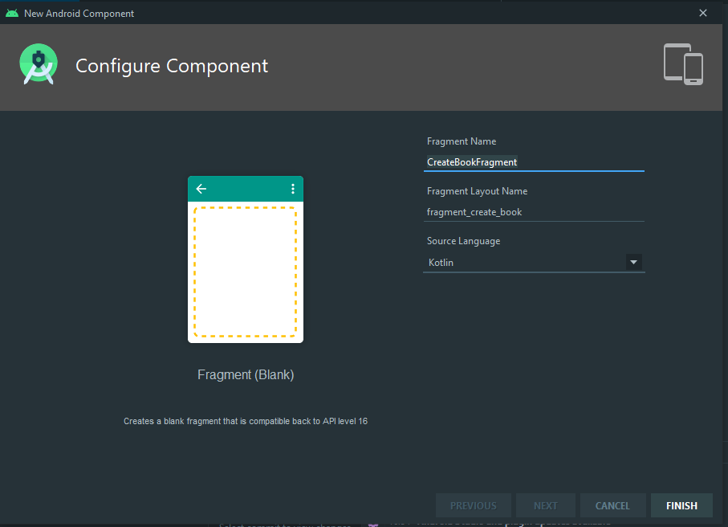
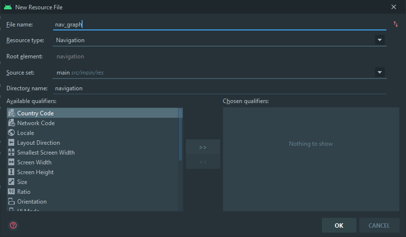
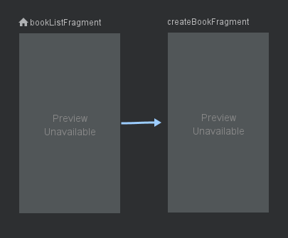
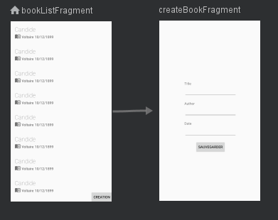
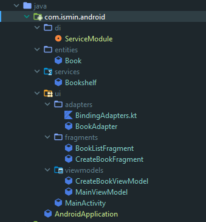

# Activity vers Fragments

## Préparation

Reprenez le TP précédent.

Nous avions fait une `Activity` par cas d'utilisations.

Aujourd'hui, nous allons faire un `Fragment` par cas d'utilisation.

**Dans un premier temps**, nous allons faire migrer tout ce qu'il y a dans une `Activity` vers un `Fragment`, en ignorant pour l'instant le routage.

**Après avoir convertit**, on mettra en place le routage avec le *Navigation component* et éventuellement avec *Navigation safe args* pour assurer le *type-safety*.

**Enfin**, nous allons extraire les dépendances et mettre en place des `ViewModelFactory`.

## Tâche : Migration

**Commençons par le plus "indépendant", soit `CreateBookActivity` :**

-  Faites un `CreateBookFragment` avec le wizard d'Android Studio :



- Gardez uniquement :

  ```kotlin
  class CreateBookFragment : Fragment() {
       override fun onCreateView(
          inflater: LayoutInflater, container: ViewGroup?,
          savedInstanceState: Bundle?
      ): View? {
          // Inflate the layout for this fragment
          return inflater.inflate(R.layout.fragment_create_book, container, false)
      }
  }
  ```

- Dans l'XML, copiez/collez de `activity_create_book.xml` vers `fragment_create_book.xml` et changez le `tools:context`.

  ```xml
  <?xml version="1.0" encoding="utf-8"?>
  <layout xmlns:android="http://schemas.android.com/apk/res/android"
      xmlns:app="http://schemas.android.com/apk/res-auto"
      xmlns:tools="http://schemas.android.com/tools">
  
      <data>
  
          <variable
              name="viewModel"
              type="com.ismin.android.CreateBookViewModel" />
      </data>
  
      <androidx.constraintlayout.widget.ConstraintLayout
          android:layout_width="match_parent"
          android:layout_height="match_parent"
          tools:context=".CreateBookFragment">  <!-- CHANGEZ ICI -->
  
          <EditText
              android:id="@+id/a_create_book_edt_title"
              ... />
  
          <EditText
              android:id="@+id/a_create_book_edt_author"
              ... />
  
          <EditText
              android:id="@+id/a_create_book_edt_date"
              ... />
  
          <Button
              android:id="@+id/a_create_book_btn_save"
              ... />
  
          <TextView
              android:id="@+id/a_create_book_txv_author"
              ... />
  
          <TextView
              android:id="@+id/a_create_book_txv_title"
              ... />
  
          <TextView
              android:id="@+id/a_create_book_txv_date"
              ... />
      </androidx.constraintlayout.widget.ConstraintLayout>
  </layout>
  ```

- Faites le DataBinding, mettez le ViewModel et l'observer (l'action sera vide pour l'instant) :

  ```kotlin
  class CreateBookFragment : Fragment() {
      private lateinit var binding : FragmentCreateBookBinding
      private val viewModel by viewModels<CreateBookViewModel>()
  
      override fun onCreateView(
          inflater: LayoutInflater, container: ViewGroup?,
          savedInstanceState: Bundle?
      ): View? {
          binding = FragmentCreateBookBinding.inflate(inflater, container, false)
          binding.viewModel = viewModel
          binding.lifecycleOwner = viewLifecycleOwner  // Notez la différence ici
  
          viewModel.saveBook.observe(viewLifecycleOwner, { // Notez la différence ici
              it?.let {
                  viewModel.toBook()?.let { book ->
                      TODO("Create a book and go back")
                  }
                  viewModel.saveBookDone()
              }
          })
          return binding.root
      }
  }
  ```

- Supprimez `CreateBookActivity` et son XML, ainsi que toute référence à ces fichiers. (Voir dans `AndroidManifest.xml`)

Cela suffira pour l'instant. Passons au `MainActivity`.

Actuellement, `MainActivity` remplit la fonction d'afficher la liste. Comme, nous utilisons maintenant des `Fragment`, `MainActivity` va devenir **un hôte** pour naviguer entre différent fragments.

Par conséquent, allons migrer le contenu dans un fragment ayant un nom plus approprié :

- Créez un `BookListFragment` avec le wizard d'Android Studio

- Faites comme précédemment (modifiez l'XML et faites le binding)

  - ```xml
    <?xml version="1.0" encoding="utf-8"?>
    <layout xmlns:android="http://schemas.android.com/apk/res/android"
        xmlns:app="http://schemas.android.com/apk/res-auto"
        xmlns:tools="http://schemas.android.com/tools">
    
        <data>
    
            <variable
                name="viewModel"
                type="com.ismin.android.MainViewModel" />
        </data>
    
        <androidx.constraintlayout.widget.ConstraintLayout
            android:layout_width="match_parent"
            android:layout_height="match_parent"
            tools:context=".BookListFragment">   <!-- CHANGEZ ICI -->
    
            <androidx.recyclerview.widget.RecyclerView
                android:id="@+id/a_main_rcv_books"
                android:layout_width="0dp"
                android:layout_height="0dp"
                app:books="@{viewModel.books}"
                app:layout_constraintBottom_toBottomOf="parent"
                app:layout_constraintEnd_toEndOf="parent"
                app:layout_constraintStart_toStartOf="parent"
                app:layout_constraintTop_toTopOf="parent"
                tools:itemCount="10"
                tools:listitem="@layout/row_book" />
    
            <Button
                android:id="@+id/a_main_btn_creation"
                android:layout_width="wrap_content"
                android:layout_height="wrap_content"
                android:onClick="@{() -> viewModel.goToCreation()}"
                android:text="Creation"
                app:layout_constraintBottom_toBottomOf="parent"
                app:layout_constraintEnd_toEndOf="parent" />
        </androidx.constraintlayout.widget.ConstraintLayout>
    </layout>
    ```

  - ```kotlin
    class BookListFragment : Fragment() {
        private val viewModel by viewModels<MainViewModel>()
        private lateinit var binding: FragmentBookListBinding
    
        override fun onCreateView(
            inflater: LayoutInflater, container: ViewGroup?,
            savedInstanceState: Bundle?
        ): View? {
            binding = FragmentBookListBinding.inflate(inflater, container, false)
            binding.viewModel = viewModel
            binding.lifecycleOwner = viewLifecycleOwner // Notez la différence ici
            viewModel.goToCreation.observe(viewLifecycleOwner, { // Notez la différence ici
                it?.let {
                    TODO("Go to CreateBookFragment")
                    viewModel.goToCreationDone()
                }
            })
    
            binding.aMainRcvBooks.adapter = BookAdapter()
            val linearLayoutManager = LinearLayoutManager(context) // Notez la différence ici
            binding.aMainRcvBooks.layoutManager = linearLayoutManager
    
            val dividerItemDecoration = DividerItemDecoration(context, linearLayoutManager.orientation) // ici
            binding.aMainRcvBooks.addItemDecoration(dividerItemDecoration)
            return binding.root
        }
    }
    ```

- Renommez (refactorisez) `MainViewModel ` par `BookListViewModel`

- Dans le `activity_main.xml`, nous allons désactiver le DataBinding et supprimez son contenu. (On le purge.)

  ```xml
  <?xml version="1.0" encoding="utf-8"?>
  <androidx.constraintlayout.widget.ConstraintLayout
      xmlns:android="http://schemas.android.com/apk/res/android"
      xmlns:app="http://schemas.android.com/apk/res-auto"
      xmlns:tools="http://schemas.android.com/tools"
      android:layout_width="match_parent"
      android:layout_height="match_parent"
      tools:context=".MainActivity">
  
  
  </androidx.constraintlayout.widget.ConstraintLayout>
  ```

- Dans `MainActivity.kt`, supprimez tout sauf la déclaration de `onCreate` et réutilisez `R`. :

  ```kotlin
  class MainActivity : AppCompatActivity() {
      override fun onCreate(savedInstanceState: Bundle?) {
          super.onCreate(savedInstanceState)
          setContentView(R.layout.activity_main)
      }
  }
  ```

  Nous pourrions faire du DataBinding. Cependant, comme `MainActivity` ne contient pas de données, autant désactiver le DataBinding pour avoir le minimum de complexité.

## Tâche : Navigation Component and SafeArgs

### Préparation

Nous allons ajouter un plugin appelé safe args, qui permet de naviguer plus facilement avec des classes auto-générées.

- Dans `build.gradle` du projet, ajoutez le plugin au classpath :

  ```groovy
  buildscript {
      ext {
          kotlin_version = "1.4.10"
          nav_version = "2.3.1"
      }
      repositories {
          google()
          jcenter()
      }
      dependencies {
          classpath 'com.android.tools.build:gradle:4.1.0'
          classpath "org.jetbrains.kotlin:kotlin-gradle-plugin:$kotlin_version"
          classpath "androidx.navigation:navigation-safe-args-gradle-plugin:$nav_version"
      }
  }
  
  allprojects {
      repositories {
          google()
          jcenter()
      }
  }
  
  task clean(type: Delete) {
      delete rootProject.buildDir
  }
  ```

- Dans le `build.gradle` du module `app`, ajoutez les dépendances de Navigation Component :

  ```groovy
  plugins {
      id 'com.android.application'
      id 'kotlin-android'
      id 'kotlin-android-extensions'
      id 'kotlin-kapt'
      id 'androidx.navigation.safeargs.kotlin'  // Ajoutez
  }
  
  // ...
  
  dependencies {
      implementation fileTree(dir: "libs", include: ["*.jar"])
      implementation "org.jetbrains.kotlin:kotlin-stdlib:$kotlin_version"
      
      // Core KTX
      implementation 'androidx.core:core-ktx:1.3.2'
  
      // Navigation
      implementation "androidx.navigation:navigation-fragment-ktx:$nav_version"
      implementation "androidx.navigation:navigation-ui-ktx:$nav_version"
  
      // Activity
      implementation "androidx.activity:activity-ktx:1.1.0"
      implementation 'androidx.legacy:legacy-support-v4:1.0.0'
  
      // Fragment
      implementation "androidx.fragment:fragment-ktx:1.2.5"
  
      // Lifecycle
      def lifecycle_version = '2.2.0'
      implementation "androidx.lifecycle:lifecycle-livedata-ktx:$lifecycle_version"
      implementation "androidx.lifecycle:lifecycle-viewmodel-ktx:$lifecycle_version"
  
      implementation 'androidx.appcompat:appcompat:1.2.0'
      implementation 'androidx.constraintlayout:constraintlayout:2.0.2'
      implementation 'androidx.recyclerview:recyclerview:1.1.0'
      testImplementation 'junit:junit:4.13.1'
      androidTestImplementation 'androidx.test.ext:junit:1.1.2'
      androidTestImplementation 'androidx.test.espresso:espresso-core:3.3.0'
  }
  ```

### Créez un graphe de navigation

- Ajoutez une ressource de type Navigation :

  

  

- Remarquez immédiatement l'interface. Ajoutez les pages avec .

  - Ajoutez `BookListFragment` et `CreateBookFragment`

  - Faites le lien entre `BookListFragment` et `CreateBookFragment`

    

    Notez le nom de l'action *action_bookListFragment_to_createBookFragment*. Navigation Component et Safe Args génèreront automatiquement un une classe permettant d'effectuer cette action.

  - Si cela affiche "Preview Unavailable", mettez vous en mode *Code*, ajoutez `tools:layout` pour chaque `fragment ` et faites correspondre avec la ressource appropriée :

    ```xml
    <?xml version="1.0" encoding="utf-8"?>
    <navigation xmlns:android="http://schemas.android.com/apk/res/android"
        xmlns:app="http://schemas.android.com/apk/res-auto"
        xmlns:tools="http://schemas.android.com/tools"
        android:id="@+id/nav_graph"
        app:startDestination="@id/bookListFragment">
    
        <fragment
            android:id="@+id/bookListFragment"
            android:name="com.ismin.android.BookListFragment"
            android:label="BookListFragment"
            tools:layout="@layout/fragment_book_list">
            <action
                android:id="@+id/action_bookListFragment_to_createBookFragment"
                app:destination="@id/createBookFragment" />
            
        </fragment>
        <fragment
            android:id="@+id/createBookFragment"
            android:name="com.ismin.android.CreateBookFragment"
            android:label="CreateBookFragment"
            tools:layout="@layout/fragment_create_book"/>
    </navigation>
    ```

    

- Revenez au `activity_main.xml`, il faut maintenant mettre un `fragment` dédié à la navigation :

  ```xml
  <?xml version="1.0" encoding="utf-8"?>
  <androidx.constraintlayout.widget.ConstraintLayout xmlns:android="http://schemas.android.com/apk/res/android"
      xmlns:app="http://schemas.android.com/apk/res-auto"
      xmlns:tools="http://schemas.android.com/tools"
      android:layout_width="match_parent"
      android:layout_height="match_parent"
      tools:context=".MainActivity">
  
      <fragment
          android:id="@+id/nav_host_fragment"
          android:name="androidx.navigation.fragment.NavHostFragment"
          android:layout_width="0dp"
          android:layout_height="0dp"
          app:defaultNavHost="true"
          app:layout_constraintBottom_toBottomOf="parent"
          app:layout_constraintLeft_toLeftOf="parent"
          app:layout_constraintRight_toRightOf="parent"
          app:layout_constraintTop_toTopOf="parent"
          app:navGraph="@navigation/nav_graph" />
  
  </androidx.constraintlayout.widget.ConstraintLayout>
  ```

- Revenez dans le `MainActivity`, liez la navigation avec le graphe et activez la navigation arrière :

  ```kotlin
  package com.ismin.android
  
  import android.os.Bundle
  import androidx.appcompat.app.AppCompatActivity
  import androidx.navigation.findNavController
  import androidx.navigation.ui.NavigationUI
  
  class MainActivity : AppCompatActivity() {
      override fun onCreate(savedInstanceState: Bundle?) {
          super.onCreate(savedInstanceState)
          setContentView(R.layout.activity_main)
          val navController = findNavController(R.id.nav_host_fragment)
          NavigationUI.setupActionBarWithNavController(this, navController)
      }
  
      override fun onSupportNavigateUp(): Boolean {
          val navController = this.findNavController(R.id.nav_host_fragment)
          return navController.navigateUp()
      }
  }
  ```

### Direction BookListFragment vers CreateBookFragment

- Dans `BookListFragment`, effectuez la navigation avec `findNavController()` et la classe généré `BookListFragmentDirections`.

  ```kotlin
  viewModel.goToCreation.observe(viewLifecycleOwner, {
      it?.let {
          findNavController().navigate(
              BookListFragmentDirections.actionBookListFragmentToCreateBookFragment()
          )
          viewModel.goToCreationDone()
      }
  })
  ```

  Si vous ne trouvez pas la classe `BookListFragmentDirections`, compilez. Cela génèrera la classe.

### Direction CreateBookFragment vers BookListFragment

Navigation Component est actuellement une stack de pages. Pour revenir en arrière, il suffit de "pop".

```kotlin
viewModel.toBook()?.let { book ->
                         findNavController().popBackStack()
                        }
```

### Créer un livre

Avec navigation component, **il n'est pas possible d'envoyer des données lorsque l'on souhaite revenir en arrière**. 

Pourquoi ?

**Simplement, parce que l'envoi de données ne sert qu'à modifier l'agencement du Fragment, soit uniquement dans une seule direction.**

Imaginez une page Web. Lorsque l'on revient en arrière, il n'y a pas de création de livre à ce que je sache ?

Actuellement, notre architecture est couplé, c'est-à-dire, que pour accéder au `bookshelf` (un service de bas niveau), il faut le récupérer du parent (un composant de haut niveau).

Par conséquent, on peut :

1. Injecter `bookshelf` en singleton et ajouter un livre, cependant, cela notifie pas un changement dans la liste (à moins d'utiliser Room, qui permet d'écouter les changements).

2. Faire un `ViewModel` au niveau de l'`Activity` et faire passer le `ViewModel` avec `requireActivity()`

C'est-à-dire, qu'il est possible de récupérer le `ViewModel` de l'`Activity` qui contient notre service `Bookshelf` et exécuter immédiatement l'action de création.

En théorie, on opterait pour la première solution avec Room. Cependant, nous utiliserons la deuxième solution pour pouvoir tester sans Room.

- Renommez (Refactorisez) `BookListViewModel` en `MainViewModel`, car implémentation est la même. (Ouai, on annule ce que l'on a fait)

- Dans `MainActivity`, déclarez le `ViewModel` au niveau de la classe

  ```kotlin
  private val viewModel by viewModels<MainViewModel>()
  ```

- Faites le binding :

  ```kotlin
  class MainActivity : AppCompatActivity() {
      lateinit var binding: ActivityMainBinding
      private val viewModel by viewModels<MainViewModel>()
  
      override fun onCreate(savedInstanceState: Bundle?) {
          super.onCreate(savedInstanceState)
          binding = ActivityMainBinding.inflate(layoutInflater)
          binding.viewModel = viewModel
  
          setContentView(binding.root)
  
          val navController = findNavController(R.id.nav_host_fragment)
          NavigationUI.setupActionBarWithNavController(this, navController)
      }
  
      override fun onSupportNavigateUp(): Boolean {
          val navController = this.findNavController(R.id.nav_host_fragment)
          return navController.navigateUp()
      }
  }
  ```

  ```xml
  <layout xmlns:android="http://schemas.android.com/apk/res/android"
      xmlns:app="http://schemas.android.com/apk/res-auto"
      xmlns:tools="http://schemas.android.com/tools">
  
      <data>
  
          <variable
              name="viewModel"
              type="com.ismin.android.MainViewModel" />
      </data>
  
      <androidx.constraintlayout.widget.ConstraintLayout
          android:layout_width="match_parent"
          android:layout_height="match_parent"
          tools:context=".MainActivity">
  
          <fragment
              android:id="@+id/nav_host_fragment"
              android:name="androidx.navigation.fragment.NavHostFragment"
              android:layout_width="0dp"
              android:layout_height="0dp"
              app:defaultNavHost="true"
              app:layout_constraintBottom_toBottomOf="parent"
              app:layout_constraintLeft_toLeftOf="parent"
              app:layout_constraintRight_toRightOf="parent"
              app:layout_constraintTop_toTopOf="parent"
              app:navGraph="@navigation/nav_graph" />
  
      </androidx.constraintlayout.widget.ConstraintLayout>
  </layout>
  ```

  Notez que le binding est pseudo-nécessaire, mais nous avons besoin d'appeler `viewModel`, car il est `lazy`.

  Sinon, on peut exécuter `ViewModelProvider(this, MainViewModel.Factory(bookshelf)).get(MainViewModel::class.java)` dans le `onCreate` et on évite `by viewModels`.

- Ajoutez le `activityViewModel` au niveau de la classe `BookListFragment` et injectez avec `ownerProducer = { requireActivity() }` :

  ```kotlin
  class BookListFragment : Fragment() {
      private val activityViewModel by viewModels<MainViewModel> (
          ownerProducer = { requireActivity() }
      )
      private lateinit var binding: FragmentBookListBinding
  
      override fun onCreateView(
          inflater: LayoutInflater, container: ViewGroup?,
          savedInstanceState: Bundle?
      ): View? {
          binding = FragmentBookListBinding.inflate(inflater, container, false)
          binding.viewModel = activityViewModel
          binding.lifecycleOwner = viewLifecycleOwner
          activityViewModel.goToCreation.observe(viewLifecycleOwner, {
              it?.let {
                  findNavController().navigate(
                      BookListFragmentDirections.actionBookListFragmentToCreateBookFragment()
                  )
                  activityViewModel.goToCreationDone()
              }
          })
  
          binding.aMainRcvBooks.adapter = BookAdapter()
          val linearLayoutManager = LinearLayoutManager(context)
          binding.aMainRcvBooks.layoutManager = linearLayoutManager
  
          val dividerItemDecoration = DividerItemDecoration(context, linearLayoutManager.orientation)
          binding.aMainRcvBooks.addItemDecoration(dividerItemDecoration)
          return binding.root
      }
  }
  ```

- Ajoutez le `activityViewModel` au niveau de la classe, injectez avec `ownerProducer = { requireActivity() } `et effectuer l'action dans `saveBook` :

  ```kotlin
  @AndroidEntryPoint
  class CreateBookFragment : Fragment() {
      private lateinit var binding: FragmentCreateBookBinding
      private val viewModel by viewModels<CreateBookViewModel>()
      private val activityViewModel by viewModels<MainViewModel> (
          ownerProducer = { requireActivity() }
      )
  
      override fun onCreateView(
          inflater: LayoutInflater, container: ViewGroup?,
          savedInstanceState: Bundle?
      ): View? {
          binding = FragmentCreateBookBinding.inflate(inflater, container, false)
          binding.viewModel = viewModel
          binding.lifecycleOwner = viewLifecycleOwner
          viewModel.saveBook.observe(viewLifecycleOwner, {
              it?.let {
                  viewModel.toBook()?.let { book ->
                      activityViewModel.addBook(book)  // ici
                      findNavController().popBackStack()
                  }
                  viewModel.saveBookDone()
              }
          })
          return binding.root
      }
  }
  ```

### Conclusion

Nous avons pu supporter Navigation Component en faisant :

- Des fragments (*captain obvious*)
- Un graphe de navigation
- Le lien entre `MainActivity` et le graphe de navigation
- Des actions de navigation
- Les invocations de `popBackStack` et `navigate`

## Tâche : Injection de dépendance avec Hilt

### Extraction des dépendances et découplage

Actuellement, notre architecture est couplé. `MainViewModel` possède un `Bookshelf` qui est directement instancié dans le `ViewModel`.

La première chose à faire est de l'extraire.

Pour cela, revenez dans `MainViewModel` et placez le `bookshelf` en paramètre de constructeur :

```kotlin
class MainViewModel(private val bookshelf: Bookshelf) : ViewModel() {
    private val theLordOfTheRings = Book(
    // ...
```

Cette modification empêche d'utiliser `by viewModels`. Pour régler ce problème, on fait une classe `Factory` (créateur de classe), qui permet d'injecter les dépendances dans le `ViewModel`.

Faites le `Factory` :

```kotlin
class MainViewModel(private val bookshelf: Bookshelf) : ViewModel() {
    private val theLordOfTheRings = Book(
    // ...
    class Factory(
        private val bookshelf: Bookshelf,
    ) : ViewModelProvider.Factory {
        @Suppress("UNCHECKED_CAST")
        override fun <T : ViewModel?> create(modelClass: Class<T>): T {
            return MainViewModel(bookshelf) as T
        }
    }
}
```

Afin de ne pas polluer les classes, **mettez toujours les factories en dernier**.

Revenez dans `BookListFragment`, et, de la même manière que nous avons injecté avec `requireParentFragment`, on utilise directement le `Factory` :

```kotlin
class MainActivity : AppCompatActivity() {
    private val bookshelf = Bookshelf()  // On le met temporairement ici
    private val viewModel by viewModels<MainViewModel> { BookListViewModel.Factory(bookshelf) }
```

Vous remarquez immédiatement que, cette fois-ci, `Fragment` est couplé à `Bookshelf`. Une solution de faire un **Singleton** en utilisant le mot clé `object` à la place de `class` dans `Bookshelf`. Cependant, cela ignore complètement le lifecycle de l'application.

Une autre technique est d'utiliser **Dagger** qui permet l'injection de dépendances liés à des composants. Ces composants Dagger sont liés aux lifecycles des composants Android.

Cependant, **Dagger** est actuellement fastidieux pour la création de ces composants. Par conséquent, on utilisera **Hilt** implémente Dagger et qui possède déjà ces composants.

### Préparation

Ajoutez le plugin Hilt au projet Android :

```groovy
buildscript {
    ext {
        kotlin_version = '1.4.10'
        nav_version = '2.3.1'
        hilt_version = '2.29.1-alpha'
    }
    repositories {
        google()
        jcenter()
    }
    dependencies {
        classpath 'com.android.tools.build:gradle:4.1.0'
        classpath "org.jetbrains.kotlin:kotlin-gradle-plugin:$kotlin_version"
        classpath "androidx.navigation:navigation-safe-args-gradle-plugin:$nav_version"
        classpath "com.google.dagger:hilt-android-gradle-plugin:$hilt_version"
    }
}
```

Activez le plugin dans le module `app` et ajoutez les dépendances :

```groovy
plugins {
    id 'com.android.application'
    id 'kotlin-android'
    id 'kotlin-android-extensions'
    id 'kotlin-kapt'
    id 'androidx.navigation.safeargs.kotlin'
    id 'dagger.hilt.android.plugin'
}
// ...
dependencies {
    implementation fileTree(dir: "libs", include: ["*.jar"])
    implementation "org.jetbrains.kotlin:kotlin-stdlib:$kotlin_version"

    // Core KTX
    implementation 'androidx.core:core-ktx:1.3.2'

    // Navigation
    implementation "androidx.navigation:navigation-fragment-ktx:$nav_version"
    implementation "androidx.navigation:navigation-ui-ktx:$nav_version"

    // Activity
    implementation "androidx.activity:activity-ktx:1.1.0"
    implementation 'androidx.legacy:legacy-support-v4:1.0.0'

    // Fragment
    implementation "androidx.fragment:fragment-ktx:1.2.5"

    // Lifecycle
    def lifecycle_version = '2.2.0'
    implementation "androidx.lifecycle:lifecycle-livedata-ktx:$lifecycle_version"
    implementation "androidx.lifecycle:lifecycle-viewmodel-ktx:$lifecycle_version"

    // Dagger Hilt
    implementation "com.google.dagger:hilt-android:$hilt_version"
    kapt "com.google.dagger:hilt-android-compiler:$hilt_version"

    implementation 'androidx.appcompat:appcompat:1.2.0'
    implementation 'androidx.constraintlayout:constraintlayout:2.0.2'
    implementation 'androidx.recyclerview:recyclerview:1.1.0'
    testImplementation 'junit:junit:4.13.1'
    androidTestImplementation 'androidx.test.ext:junit:1.1.2'
    androidTestImplementation 'androidx.test.espresso:espresso-core:3.3.0'
}
```

### Faire une Application injectable

- Créez une classe `AndroidApplication` qui hérite de `Application` et l'annotez avec `HiltAndroidApp`.

  ```kotlin
  // AndroidApplication
  @HiltAndroidApp
  class AndroidApplication: Application()
  ```

- Dans le `AndroidManifest.xml`, utilisez la classe `AndroidApplication`

  ```xml
  <?xml version="1.0" encoding="utf-8"?>
  <manifest xmlns:android="http://schemas.android.com/apk/res/android"
      package="com.ismin.android">
  
      <!-- ICI: android:name=".AndroidApplication" -->
      <application
          android:name=".AndroidApplication"  
          android:allowBackup="true"
          android:icon="@mipmap/ic_launcher"
          android:label="@string/app_name"
          android:roundIcon="@mipmap/ic_launcher_round"
          android:supportsRtl="true"
          android:theme="@style/AppTheme">
          <activity android:name="com.ismin.android.MainActivity">
              <intent-filter>
                  <action android:name="android.intent.action.MAIN" />
  
                  <category android:name="android.intent.category.LAUNCHER" />
              </intent-filter>
          </activity>
      </application>
  
  </manifest>
  ```

### Faire une Activity injectable

- Annotez `MainActivity` avec `@AndroidEntryPoint`

  ```kotlin
  @AndroidEntryPoint
  class MainActivity : AppCompatActivity() {
      // ...
  ```

### Faire le module d'injection

Un module décrit comment on injecte une dépendance.

Par exemple, si l'injection est compliqué cela peut prendre cette forme :

```kotlin
@Module
@InstallIn(ApplicationComponent::class)
object DataModule {
    @ExperimentalSerializationApi
    @Provides
    @Singleton
    fun provideBookshelfDataSource(client: Lazy<OkHttpClient>): BookshelfDataSource {
        return Retrofit.Builder()
            .baseUrl(BookshelfDataSource.BASE_URL)
            .client(client.get())
            .addConverterFactory(
                Json { ignoreUnknownKeys = true }.asConverterFactory(
                    BookshelfDataSource.CONTENT_TYPE.toMediaType()
                )
            )
            .build()
            .create(BookshelfDataSource::class.java)  // Un builder
    }

    @Provides
    @Singleton
    fun provideHttpClient() = OkHttpClient()  // Une simple instanciation

    @Singleton
    @Provides
    fun provideRoomDatabase(@ApplicationContext context: Context): LocalDataSource {
        return Room.databaseBuilder(
            context,
            LocalDataSource::class.java,
            "app.db"
        ).build()  // Un builder
    }

    @Singleton
    @Provides
    fun provideBookDao(local: Lazy<LocalDataSource>): BookDao {
        return local.get().bookDao()  // Un getter
    }
}
```

Pour l'instant, nous allons faire un `ServiceModule` qui s'injectera au niveau de l'application (ou singleton) :

```kotlin
@Module
@InstallIn(ApplicationComponent::class)
object ServiceModule {
    @Provides
    @Singleton
    fun provideBookshelf(): Bookshelf {
        return Bookshelf()
    }
}
```

D'ailleurs, autant initialiser les livres à ce niveau. Déplacez les livres dans le provider :

```kotlin
@Module
@InstallIn(ApplicationComponent::class)
object ServiceModule {
    @Provides
    @Singleton
    fun provideBookshelf(): Bookshelf {
        val bookshelf = Bookshelf()
        val theLordOfTheRings = Book(
            title = "The Lord of the Rings",
            author = "J. R. R. Tolkien",
            date = "1954-02-15"
        )
        val theHobbit = Book(
            title = "The Hobbit",
            author = "J. R. R. Tolkien",
            date = "1937-09-21"
        )
        val aLaRechercheDuTempsPerdu = Book(
            title = "À la recherche du temps perdu",
            author = "Marcel Proust",
            date = "1927"
        )
        bookshelf.addBook(theLordOfTheRings)
        bookshelf.addBook(theHobbit)
        bookshelf.addBook(aLaRechercheDuTempsPerdu)
        return bookshelf
    }
}
```

```kotlin
class MainViewModel(private val bookshelf: Bookshelf) : ViewModel() {
    private val _books = MutableLiveData<List<Book>>(emptyList())
    val books: LiveData<List<Book>>
        get() = _books

    init {
        _books.value = bookshelf.getAllBooks()
    }
    // ...
```

Notre `MainViewModel` est maintenant clean !

Passons au `MainActivity`.

### Injecter

Pour injecter n'importe quel classe, il faut annoter le membre avec `@Inject` pour faire une injection par membre.

```kotlin
@AndroidEntryPoint
class MainActivity : AppCompatActivity() {
    @Inject
    lateinit var bookshelf: Bookshelf  // Ne peut pas être private si Hilt est utilisé
    private val viewModel by viewModels<MainViewModel> { MainViewModel.Factory(bookshelf) }
    private lateinit var binding: ActivityMainBinding
    // ...
```

Comme `Bookshelf` possède un provider dans le `ServiceModule`, celui peut se faire injecter dans `Activity`.

Comme le provider est annoté avec `@Singleton` et que le module est au niveau de l'application, notre service est lié au lifecycle de l'`AndroidApplication`.

## Conclusion

Bravo !

Vous avez mis en place des Fragments avec un routage basé sur Navigation Component.

En plus, vous avez pu mettre un injecteur de dépendances.

Cependant, ce n'est pas encore terminé. Il reste à voir :

- Room avec Kotlin Coroutines
- Retrofit avec Kotlin Coroutines
- Repository Pattern
- (Coil/Glide pour gérer les images)

## Bonus

### Folder structure

Bougeons un peu les choses :



### Navigation Component Animation

Cliquez sur l'action et le menu de droite devrait apparaitre :


On optera pour :

```xml
app:enterAnim="@anim/nav_default_enter_anim"
app:exitAnim="@anim/nav_default_exit_anim"
app:popEnterAnim="@anim/nav_default_pop_enter_anim"
app:popExitAnim="@anim/nav_default_pop_exit_anim"
```

