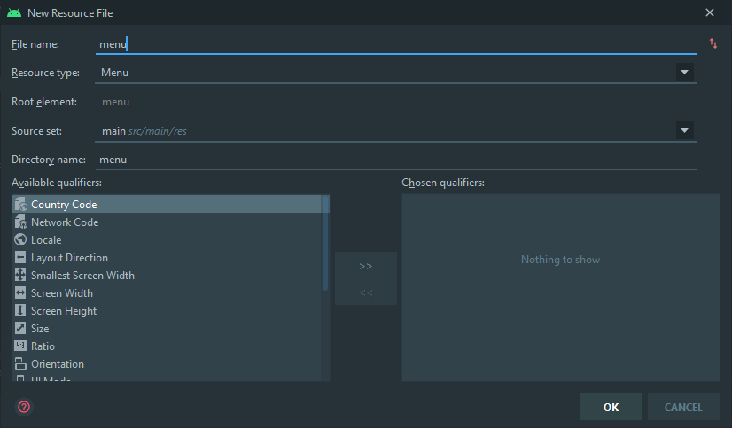
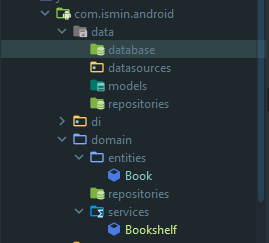
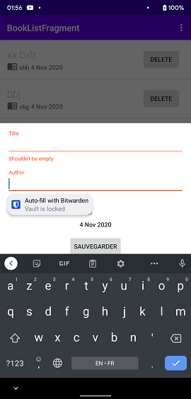

# Architecture Android Complète

## Préparation

Dernière ligne droite !

Il ne reste plus qu'à faire la couche data et la couche domain.

Avant de continuer, on va mettre à jour l'application par rapport au cours de gaetanmaisse.

Nous pourrions merge de geatanmaisse/...tp4 vers notre dépot. Cependant, ça n'a pas beaucoup d'intêret à ce point vu que nous avons bien divergé.

### Faites un menu

Il contient qu'un menu item : "Clear". Avec le wizard d'Android Studio :



Faites une ressource de type menu appelé "menu".

Mettez un item :

```xml
<?xml version="1.0" encoding="utf-8"?>
<menu xmlns:android="http://schemas.android.com/apk/res/android">

    <item
        android:id="@+id/clear"
        android:title="@string/clear" />
</menu>

```

Pour le `@string/clear`, mettez votre propre texte. (`Alt` + `Enter` sur l'erreur et mettez votre propre valeur.)

Au `MainActivity.kt`, `override` les méthodes qui permettent de supporter un menu. (Ne tentez pas d'apprendre par cœur ces fonctions, cependant, pensez à la documentation la prochaine fois.)

```kotlin
@AndroidEntryPoint
class MainActivity : AppCompatActivity() {
    // ...

    override fun onCreateOptionsMenu(menu: Menu?): Boolean {
        menuInflater.inflate(R.menu.menu, menu)
        return true
    }

    override fun onOptionsItemSelected(item: MenuItem): Boolean {
        return when (item.itemId) {
            R.id.clear -> {
                viewModel.clearAllBooks()
                true
            }
            else -> super.onOptionsItemSelected(item)
        }
    }
}
```

Dans le `MainViewModel`, implémentez `fun clearAllBooks()` :

```kotlin
// MainViewModel.kt
fun clearAllBooks() {
    bookshelf.clearAllBooks()
    _books.value = bookshelf.getAllBooks()
}
```

Et donc dans le `Bookshelf` :

```kotlin
// Bookshelf.kt
fun clearAllBooks() = storage.clear()
```

Ok, ça devrait suffire.

### Installations des dépendances

Dans le `build.gradle` du module `app`, ajoutez :

```groovy
plugins {
    id 'com.android.application'
    id 'kotlin-android'
    id 'kotlin-android-extensions'
    id 'kotlin-kapt'
    id 'androidx.navigation.safeargs.kotlin'
    id 'dagger.hilt.android.plugin'
    id 'org.jetbrains.kotlin.plugin.serialization' version '1.4.10'  // Ici !
}

android {
    compileSdkVersion 30
    buildToolsVersion "30.0.2"

    buildFeatures {
        dataBinding true
    }

    defaultConfig {
        applicationId "com.ismin.androidtp2"
        minSdkVersion 22
        targetSdkVersion 30
        versionCode 1
        versionName "1.0"

        testInstrumentationRunner "androidx.test.runner.AndroidJUnitRunner"

        javaCompileOptions {  // Ajoutez ceci !
            annotationProcessorOptions {
                arguments += [
                        "room.schemaLocation"                         : "$projectDir/schemas".toString(),
                        "room.incremental"                            : "true",
                        "room.expandProjection"                       : "true"]
            }
        }
    }
}

dependencies {
    // ...

    // Serializer
    implementation "org.jetbrains.kotlinx:kotlinx-serialization-json:1.0.0"

    // Retrofit for networking
    implementation "com.squareup.retrofit2:retrofit:2.9.0"
    implementation "com.jakewharton.retrofit:retrofit2-kotlinx-serialization-converter:0.8.0"
    implementation "com.squareup.okhttp3:okhttp:4.9.0"
    
    // Coroutines
    def coroutines = '1.4.0'
    implementation "org.jetbrains.kotlinx:kotlinx-coroutines-core:$coroutines"
    implementation "org.jetbrains.kotlinx:kotlinx-coroutines-android:$coroutines"
    
    // Room
    def room_version = '2.2.5'
    implementation "androidx.room:room-runtime:$room_version"
    implementation "androidx.room:room-ktx:$room_version"
    kapt "androidx.room:room-compiler:$room_version"
    
    // ...
}
```

## Tâche : Appliquer les fonctions suspend dans bookshelf

Un fonction `suspend` (`suspend fun do()`) est un fonction qui se lance dans un thread ou une pool de threads (=coroutine) et attend une réponse.

Par rapport à Javascript, cela est équivalent faire `await do()`. Par conséquent, cela force à attendre le résultat et empêcher le fire-and-forget accidentel.

Exemple avec le langage Dart (qui possède async/await nativement et sera plus facile à expliquer) :

```dart
// Dart utilise la syntaxe Java
Future<void> doFirst() async {
    doStuffForALogTime();
}
Future<void> doSecond() async {
    doStuffForALogTime2();
}

Future<void> main() async {
    final future = doFirst();  // future=Future<void> object
    final future2 = doSecond();  // future2=Future<void> object
}
```

En lançant le programme de cette manière, **le programme va actuellement s'arrêter abruptement.** En effet, nous avons oubliés de `await`. Par conséquent, `promise` et `promise2` tournent dans des threads en arrière-plan, mais la fonction `main` sera déjà terminé vu qu'elle tourne le thread principal. Si on était en bas niveau, il s'agit d'un cas de `fork/join`, où `async` = `fork` et `await` = `join`. Donc, lancer une fonction `async` va `fork` vers un nouveau thread et `await` va `join` ce thread au résultat.

```dart
// Solution pour régler ce problème
Future<void> doFirst() async {
    doStuffForALogTime();
}
Future<void> doSecond() async {
    doStuffForALogTime2();
}

Future<void> main() async {
    final result = await doFirst();  // result=Void object
    final result2 = await doSecond();  // result2=Void object
}
```

Cela est équivalent en Kotlin à :

```kotlin
suspend fun doFirst(): Unit {
    doStuffForALogTime()
}
suspend fun doSecond(): Unit {
    doStuffForALogTime2()
}
fun main() = runBlocking<Unit> {
    val result = doFirst()  // result=Unit object
    val result2 = doSecond()  // result2=Unit object
}
```

C'est pour cela que Kotlin est dit `sequential` par défaut, comparé à JS qui est `async` by default. C'est-à-dire que si on déclare :

```kotlin
suspend fun doSomethingUsefulOne(): Int {
    delay(1000L) // pretend we are doing something useful here
    return 13
}

suspend fun doSomethingUsefulTwo(): Int {
    delay(1000L) // pretend we are doing something useful here, too
    return 29
}
```

On qu'on les exécute dans une coroutine :

```kotlin
runBlocking<Unit> {
    doSomethingUsefulOne()
    doSomethingUsefulTwo()
}
```

Les fonctions exécutent à la suite (et non en parallèle) !

Pour les lancer en parallèle, on peut utiliser **`launch`** (fire-and-forget) ou **`async`** (async-and-await).

```kotlin
fun main() = runBlocking<Unit> {
    val one = async { doSomethingUsefulOne() }
    val two = async { doSomethingUsefulTwo() }
    println("The answer is ${one.await() + two.await()}")
}
```

On utilise `.await()` pour les `async` pour récupérer les résultats. (Les `launch` sont des fire-and-forget. Ils n'ont pas de `.await()`). On retrouve le pattern async-await.

Equivalent en Dart :

```dart
Future<int> doSomethingUsefulOne() async {
    delay(1000L); // pretend we are doing something useful here
    return 13;
}
Future<int> doSomethingUsefulTwo() async {
    delay(1000L); // pretend we are doing something useful here, too
    return 29;
}
Future<void> main() async {
    final future = doFirst();
    final future2 = doSecond();
    print("The answer is ${await future + await future2}")
}
```

Avec `launch` :

```kotlin
fun main() = runBlocking<Unit> {
    launch { doSomethingUsefulOne() }
    launch { doSomethingUsefulTwo() }
}
```

```dart
Future<void> main() async {
    final future = doFirst();
    final future2 = doSecond();
}
```

Cependant, remarquez que Kotlin possède une spécificité qui est le **"Coroutine scope".** C'est exactement ce que cela signifie : il s'agit d'un scope définissant quel morceau de bloc de code peut être lancé avec `suspend`. Avec Dart, JS et autre langage basé sur async-await, le scope est définit avec **async** est au niveau de la fonction obligatoirement.

Avec Kotlin, on peut se permettre d'être plus précis. En définissant une coroutine scope, on est capable de lier ce scope avec un lifecycle.

Par exemple, `runBlocking` créer un scope selon les accolades et attends jusqu'à que les "jobs"/"tâches" soient terminés.

Par conséquent, sachant que Core KTX implémentent des scopes de coroutines dans les `ViewModel`, appelés `viewModelScope`. On pourra lancer en parallèle en faisant `viewModelScope.launch{ /* do */ }`. Les `viewModelScope` sont liés au lifecycle des `ViewModel` et donc, des Fragments/Activity.

**Mais avant de faire cela, marquons toutes nos méthodes avec `suspend`.**

```kotlin
class Bookshelf {
    private val storage = HashMap<String, Book>()

    suspend fun addBook(book: Book) {
        storage[book.title] = book
    }

    suspend fun getBook(title: String): Book? = storage[title]

    suspend fun getAllBooks(): ArrayList<Book> {
        return ArrayList(storage.values.sortedBy { book -> book.title })
    }

    suspend fun getBooksOf(author: String): List<Book> {
        val filteredStorage = storage.filter { it.value.author == author }
        return ArrayList(filteredStorage.values).sortedBy { book -> book.title }
    }

    suspend fun getTotalNumberOfBooks(): Int = storage.size

    suspend fun clearAllBooks() = storage.clear()
}
```

Maintenant, lançons les méthodes des `ViewModel` dans des scopes de coroutines :

```kotlin
class MainViewModel(private val bookshelf: Bookshelf) : ViewModel() {
    private val _books = MutableLiveData<List<Book>>(emptyList())
    val books: LiveData<List<Book>>
        get() = _books

    init {
        viewModelScope.launch {
            _books.value = bookshelf.getAllBooks()
        }
    }

    fun addBook(book: Book) {
        viewModelScope.launch {
            bookshelf.addBook(book)
            _books.value = bookshelf.getAllBooks()
        }
    }
    
    fun clearAllBooks() {
        viewModelScope.launch {
            bookshelf.clearAllBooks()
            _books.value = bookshelf.getAllBooks()
        }
    }
    
    // ...
}
```

## Pause : Reprenons les Threads

J'ai parlé des coroutines peut-être un peu rapidement.

Actuellement, Android tourne sous 3 catégories de threads :

- `Dispatchers.Main` ou UI Threads (pool of shared threads) pour l'interface utilisateur (Appel de méthodes `suspend`, fonctions UI, mis à jour les `LiveData`)
- `Dispatchers.IO` ou IO Thread (single-threaded) pour l'écriture et lecture (Réseau, Cache, littéralement input/output)
- `Dispatchers.Default` ou Default Threads (dual-threaded ou égale au nombre de cores) pour le travail intense (JSON parsing, algorithmes, DiffUtils)

Ces 3 catégories de threads sont très communs et **l'objectif est de ne jamais bloquer les threads UI**.


A chaque fois que nous faisons `launch`, **le contexte de coroutines est celui par défaut `Dispatchers.Default`**, ce qui permet d'être obligatoirement d'être sécurisé en terme de thread.

Cependant, une fois que nous devons faire appel à l'UI ou à l'IO, nous devons utiliser la méthode `withContext(Dispatchers.Main)` ou `withContext(Dispatchers.IO)`.

On peut également utiliser `launch(Dispatchers.XX)` et `async(Dispatchers.XX)` pour initialement lancer dans un contexte.

Exemple :

```kotlin
viewModelScope.launch(Dispatchers.Main) {  // Pour les LiveData
    withContext(Dispatchers.IO) {  // Pour télécharger
        download()
    }
    myLiveData.value = withContext(Dispatchers.IO) { // Pour télécharger
        getAllStuff()  // return@withContext
    }
}
```

Remarquez que changer de contexte n'est pas un "fire-and-forget". On ne perd pas de données en changeant de contexte.

Pour plus d'informations : [Composing Suspending Functions](https://kotlinlang.org/docs/reference/coroutines/composing-suspending-functions.html) et [Coroutine Context and Dispatchers](https://kotlinlang.org/docs/reference/coroutines/coroutine-context-and-dispatchers.html)

## Tâche : Mettez le contexte `Dispatchers.Main` aux bon endroits

Afin de respecter la séparation des responsabilités, **il n'est pas de la responsabilité d'un ViewModel d'appliquer le contexte `Dispatchers.IO`.** Cela sera les méthodes des services de bas niveau qui elle-même auront le contexte `Dispatchers.IO`.

Notre modèle se concentrera sur `Dispatchers.Main` ou `Dispatchers.Default`.

Avec ce que vous avez compris, mettez le bon contexte. Cela prend 3 lignes :

```kotlin
class MainViewModel(private val bookshelf: Bookshelf) : ViewModel() {
    private val _books = MutableLiveData<List<Book>>(emptyList())
    val books: LiveData<List<Book>>
        get() = _books

    init {
        viewModelScope.launch(Dispatchers.Main) {  // ici
            _books.value = bookshelf.getAllBooks()
        }
    }

    fun addBook(book: Book) {
        viewModelScope.launch(Dispatchers.Main) {  // ici
            bookshelf.addBook(book)
            _books.value = bookshelf.getAllBooks()
        }
    }
    
    fun clearAllBooks() {
        viewModelScope.launch(Dispatchers.Main) {
            bookshelf.clearAllBooks()
            _books.value = bookshelf.getAllBooks()
        }
    }
    
    // ...
```

Cela devrait suffire. Ca sera la responsabilité de `bookshelf` de dire si `addBook`, `getAllBooks` ou `clearAllBooks` est dans `Dispatchers.Default` ou `Dispatchers.IO`.

Donc, on devrait aller dans `Bookshelf` et appliquer `Dispatchers.Default`.

Cependant, allons faire immédiatement du networking et de l'architecture.

## Tâche : Architecture Android mis en place réel

Faites les dossiers `data` et `domain`.

`domain` contient :

- Un dossier `entities`, contenant les entités liées aux métiers
- Un dossier `services`, pour les services locaux
- Un dossier `repositories`, pour les interfaces de `repositories` récupérant des entités depuis le cache ou internet. Ca sera ici qu'on définit les contrats pour les `repositories` de la couche `Data`.

`data` contient :

- Un dossier `database` qui contient les DAO pour le cache Room et autres objets liés à Room.
- Un dossier `datasources` qui contient les clients Retrofit pour télécharger/contacter les APIs.
- Un dossier `repositories` qui contient l'implémentation des `repositories`.
- Un dossier `models` qui contient le résultats des requêtes API / Database.



Comme on doit être capable de convertir entre models et entities, on va faire des interfaces utilitaires.

**Dans le package `com.ismin.android.core.mappers`** (créez ces dossier), mettez ces interfaces :

```kotlin
package com.ismin.android.core.mappers

interface EntityMappable<out R> {
    fun asEntity(): R
}
```

```kotlin
package com.ismin.android.core.mappers

interface ModelMappable<out R> {
    fun asModel(): R
}
```

Note : `<out R>` définit la variance du générique `R`. Googlez pour connaitre la signification. Mais en gros, appliquez `out` quand `R` est retourné (covariance), `in` quand `R` est un paramètre (contravariance), rien quand `R` est retourné et est en paramètre (invariance).


**Dernière chose** : Refactorisez `ServiceModule` (dans `di`) en `DomainModule` et supprimez le provider de `Bookshelf` (On ne l'utilisera plus).

## Tâche : Cache et `Flow` avec Room

Room est une base de donnée basé sur SQLite et permet de stocker de nombreux objets complexes. C'est assez similaire à une ORM, cependant, il est beaucoup plus limité qu'un véritable ORM.

Il possède cependant un système de migration (versioning), ce qui permet d'être assez flexible en production.

Dans `database`, faites une classe abstraite `Database` qui hérite de `RoomDatabase` :

```kotlin
@Database(
    entities = [],
    version = 1
)
abstract class Database: RoomDatabase()
```

Room se chargera d'implémenter cette base de donnée.

### **Allons faire le provider de Room.**

Dans `com.ismin.android.di`, faites un `object` DataModule qui occupe le lifecycle d'un singleton (`ApplicationComponent`) et fabriquez la base de donnée avec `Room.databaseBuilder` :

```kotlin
@Module
@InstallIn(ApplicationComponent::class)
object DataModule {
    @Singleton
    @Provides
    fun provideRoomDatabase(@ApplicationContext context: Context): Database {
        return Room.databaseBuilder(
            context,
            Database::class.java,
            "app.db"
        ).build()
    }
}
```

Le nom du fichier importe peu.

### **Faisons maintenant le model du book.**

Dans `com.ismin.android.data.models`, faites une data classe `BookModel` mappable avec `Book`.

```kotlin
@Entity(tableName = "Book")
data class BookModel(
    @PrimaryKey
    val title: String,
    val author: String,
    val date: String
) : EntityMappable<Book> {
    override fun asEntity() = Book(title, author, date)
}
```

Faites également le map de l'entity avec le model :

```kotlin
data class Book(val title: String, val author: String, val date: String) :
    Serializable,
    ModelMappable<BookModel> {
    override fun asModel() = BookModel(title, author, date)
}
```

### **Déclarons le DAO pour ce model.**

Dans `package com.ismin.android.data.database`, faites une interface `BookDao` (Room se chargera de l'instancier) :

```kotlin
@Dao
interface BookDao {
    @Insert(onConflict = OnConflictStrategy.REPLACE)
    suspend fun insert(books: List<BookModel>)

    @Insert(onConflict = OnConflictStrategy.REPLACE)
    suspend fun insert(vararg book: BookModel)

    @Query("DELETE FROM Book")
    suspend fun clear()

    @Delete
    suspend fun deleteOne(book: BookModel)

    @Query("SELECT * FROM Book WHERE title=:title")
    suspend fun findById(title: String): BookModel?

    @Query("SELECT * FROM Book WHERE author=:author")
    suspend fun find(author: String): List<BookModel>

    @Query("SELECT * FROM Book")
    suspend fun find(): List<BookModel>

    @Query("SELECT * FROM Book")
    fun watch(): Flow<List<BookModel>>

    @Query("SELECT COUNT(title) FROM Book")
    suspend fun count(): Int
}
```

Notes :

Les deux première méthodes permettent l'insertion avec une `List` ou avec plusieurs arguments.

La `watch` récupère les livres du cache et observe tout changement. Il s'agit d'un **flux de données**.

**Notes à propos du type de retour** :

- Si non-nullable (`T`), alors fait crasher avec une `NullPointerException` si pas trouvé
- Si nullable `T?`,  alors retourne `null` si pas trouvé
- `List<T>`, alors vide si pas trouvé

### **Déclarons les DAO dans la `Database` et dans le `DataModule`.**

```kotlin
package com.ismin.android.data.database

@Database(
    entities = [BookModel::class],
    version = 1
)
abstract class Database: RoomDatabase() {
    abstract fun bookDao(): BookDao
}
```

```kotlin
package com.ismin.android.di

@Module
@InstallIn(ApplicationComponent::class)
object DataModule {
    @Singleton
    @Provides
    fun provideRoomDatabase(@ApplicationContext context: Context): Database {
        return Room.databaseBuilder(
            context,
            Database::class.java,
            "app.db"
        ).build()
    }

    @Singleton
    @Provides
    fun provideBookDao(database: Database): BookDao {
        return database.bookDao()
    }
}
```

**OK !**

Selon le contexte, vous aurez peut-être besoin de plusieurs DAO. Autant injecter la `Database` avec `@Inject database: Database` directement au lieu d'injecter `xDao` et `yDao`.

D'ailleurs, lorsque l'on aura plusieurs `repositories`, cela sera **peut-être** une meilleure idée de faire un `EntityManager` au lieu de faire passer chaque `repository`.

**Exemple :**

Remplacez :

```kotlin
class Service @Inject constructor(aRepository: ARepository, bRepository: BRepository) {
    fun doA() {
        aRepository.delete()
    }
    
    fun doB() {
        bRepository.clear()
    }
}
```

Par :

```kotlin
class Service @Inject constructor(em: EntityManager) {
    fun doA() {
        em.aRepository.delete()
    }
    
    fun doB() {
        em.bRepository.clear()
    }
}
```

où `EntityManager` est :

```kotlin
class EntityManager @Inject constructor(private val aRepositoryLazy: Lazy<ARepository>, private val bRepositoryLazy: Lazy<BRepository>) {
    val aRepository: ARepository
    	get() = aRepositoryLazy.get()
    
    val bRepository: BRepository
    	get() = bRepositoryLazy.get()
}
```

(Notez que le `Lazy` est une propriété de Hilt/Dagger qui permet d'instancier l'objet uniquement à l'appel de la fonction.)

### Faites un BookRepository

**Recopions les contrats depuis le `Bookshelf` :**

```kotlin
package com.ismin.android.domain.repositories

interface BookRepository {
    suspend fun addBook(book: Book)
    suspend fun getBook(title: String): Book?
    suspend fun getAllBooks(): List<Book>
    suspend fun getBooksOf(author: String): List<Book>
    suspend fun getTotalNumberOfBooks(): Int
    suspend fun clearAllBooks()
    fun watchAllBooks(): Flow<List<Book>>
}
```

**Maintenant, implémentons la classe dans la couche `data` :**

```kotlin
package com.ismin.android.data.repositories

class BookRepositoryImpl: BookRepository {
    override suspend fun addBook(book: Book) {
        TODO("Not yet implemented")
    }

    override suspend fun getBook(title: String): Book? {
        TODO("Not yet implemented")
    }

    override suspend fun getAllBooks(): List<Book> {
        TODO("Not yet implemented")
    }

    override suspend fun getBooksOf(author: String): List<Book> {
        TODO("Not yet implemented")
    }

    override suspend fun getTotalNumberOfBooks(): Int {
        TODO("Not yet implemented")
    }

    override suspend fun clearAllBooks() {
        TODO("Not yet implemented")
    }
    
    override fun watchAllBooks(): Flow<List<Book>> {
        TODO("Not yet implemented")
    }
}
```

**On va injecter `BookDao`.**

```kotlin
class BookRepositoryImpl @Inject constructor(private val bookDao: BookDao): BookRepository {
    // ...
```

**On va maintenant binder l'implémentation avec son interface dans le `DomainModule`.**

Pour cela, transformez `DomainModule` en interface. Puis avec l'annotation `@Bind`, faites la méthode prenant pour argument l'implémentation et en valeur retourné, l'interface.

```kotlin
@Module
@InstallIn(ApplicationComponent::class)
interface DomainModule {
    @Binds
    @Singleton
    fun bindBookRepository(bookRepositoryImpl: BookRepositoryImpl): BookRepository
}
```

Désormais, lorsque que l'on souhaite injecter `BookRepository`, cela injectera `BookRepositoryImpl` à la place.

Maintenant, implémentons le `BookRepositoryImpl` selon le DAO :

```kotlin
class BookRepositoryImpl @Inject constructor(private val bookDao: BookDao) : BookRepository {
    override suspend fun addBook(book: Book) {
        bookDao.insert(book.asModel())
    }

    override suspend fun getBook(title: String): Book? {
        return bookDao.findById(title)?.asEntity()
    }

    override suspend fun getAllBooks(): List<Book> {
        return bookDao.find().map { it.asEntity() }
    }

    override suspend fun getBooksOf(author: String): List<Book> {
        return bookDao.find(author).map { it.asEntity() }
    }

    override suspend fun getTotalNumberOfBooks(): Int {
        return bookDao.count()
    }

    override suspend fun clearAllBooks() {
        return bookDao.clear()
    }
}
```


**WAIT !** On utilise `.map` qui O(n) (on parcoure toute la liste et on convertit), n'est-ce pas une perte de performance ?

​	**Oui. Clairement.** Cependant, cela permet de valider les données et d'être découplé en terme de dépendances. La couche Domain ne doit pas contenir de données spécifique à la couche Data (exemple : Pagination, Date de sauvegarde ...).

Actuellement, le principe **DRY **(don't repeat yourself) peut sembler agir contre l'architecture. Cependant, **BookModel** et **Book** sont totalement différents (l'un est serializable Java, l'autre est serializable API/Database). Une solution pour résoudre cette complexité serait que `BookModel` hérite de `Book`. Cependant, ce n'est pas possible, car `Book` est une data classe.

### Supprimez Bookshelf et remplacez par BookRepository. (mettez à jour le MainViewModel)

`Bookshelf` est remplacé par `BookRepository`.

### Réglez le contexte de coroutine dans le BookRepositoryImpl

**IMPORTANT : Notez que Room et Retrofit sont UI Thread safe. Donc ne changez pas le contexte !**

Comme la responsabilité d'un repository n'est ni **IO**, ni **UI**, mais **métier**, on applique le contexte `Dispatchers.Default` lors des mappages.

```kotlin
class BookRepositoryImpl @Inject constructor(private val bookDao: BookDao) : BookRepository {
    override suspend fun addBook(book: Book) {
        withContext(Dispatchers.Default) {
            bookDao.insert(book.asModel())
        }
    }

    override suspend fun getBook(title: String): Book? {
        return withContext(Dispatchers.Default) {
            bookDao.findById(title)?.asEntity()
        }
    }

    override suspend fun getAllBooks(): List<Book> {
        return withContext(Dispatchers.Default) {
            bookDao.find().map { it.asEntity() }
        }
    }

    override suspend fun getBooksOf(author: String): List<Book> {
        return withContext(Dispatchers.Default) {
            bookDao.find(author).map { it.asEntity() }
        }
    }

    override suspend fun getTotalNumberOfBooks(): Int {
        return bookDao.count()
    }

    override suspend fun clearAllBooks() {
        bookDao.clear()
    }
}
```

### Testez

**Testez.**

Cela fonctionne plutôt bien.

Cependant, nous n'avons pas suivis la recommandation de Google.

En effet, l'objectif d'une telle architecture basé sur le repository est de ne jamais avoir de temps de chargement.


L'application **doit lire en continue** le cache afin d'utiliser les anciennes données et réactualiser si connecté à internet.

### `Flow`

Alors qu'une fonction `suspend` retourne 1 valeur de manière asynchrone, `Flow` retourne plusieurs valeurs asynchrones.

Ce `Flow` peut également être observé, mais on va préférer à le convertir en `LiveData`.

### N'utilisez plus `getAllBooks` mais `watchAllBooks`

Dans `BookRepository` et son implémentation, créez une méthode `watchAllBooks(): Flow<List<Book>>` et utilisez `bookDao.watch()`.

**La méthode ne doit pas être `suspend`.** Utilisez `flowOn` pour changer de contexte :

```kotlin
override fun watchAllBooks(): Flow<List<Book>> {
    return bookDao.watch()  // Dispatchers.IO selon Room
    .map { it.map { model -> model.asEntity() } }  // Dispatchers.Default
    .flowOn(Dispatchers.Default)
}
```

Allez dans le `MainViewModel`, supprimez `_books` et changez `books` par :

```kotlin
val books = bookRepository.watchAllBooks()
	.asLiveData(viewModelScope.coroutineContext + Dispatchers.Default)
```

On utilise `Dispatchers.Default`, car, `asLiveData ` peut être intensif.

Remplacez `_books.value = bookRepository.getAllBooks()` par `bookRepository.getAllBooks()`. **En effet,** lors de exécution de `bookRepository.getAllBooks()`, le repository se chargera de télécharger les livres et de les placer en cache.

**Supprimez également le `bookRepository.getAllBooks()` dans `addBook` et `clearAllBooks`**, car la valeur se réactualise automatiquement maintenant.

### Conclusion

Il ne reste plus que l'HTTP... courage !

## Tâche : Retrofit

### Permission

Dans le `AndroidManifest.xml`, ajoutez :

```xml
<uses-permission android:name="android.permission.INTERNET" />
```

Exemple :

```xml
<manifest xmlns:android="http://schemas.android.com/apk/res/android"
    package="com.ismin.android">
    <uses-permission android:name="android.permission.INTERNET" />

    <application
        ...
    </application>
</manifest>
```

### Commencez directement avec le BookshelfDataSource

Créez une interface `BookshelfDataSource` dans `com.ismin.android.data.datasources` avec ces requêtes :

```kotlin
interface BookshelfDataSource {
    companion object {
        const val BASE_URL = "VOTRE_URL"
        // const val BASE_URL = "https://bookshelf-marc-nguyen.cleverapps.io/"
        // Ne tentez pas cette addresse sans avoir bien sérializé bookModel
        // (Précisément, le String date doit être sous format ISO8601. Il sera plus judicieux d'utiliser
        // DateTime de Joda DateTime.)
        const val CONTENT_TYPE = "application/json; charset=utf-8"
    }

    @POST("books")
    suspend fun addBook(@Body book: BookModel)

    @GET("books")
    suspend fun findBooks(@Query("author") author: String?): PaginatedDto<BookModel>

    @GET("books/{title}")
    suspend fun findOneBook(@Path("title") title: String): BookModel?

    @DELETE("books/{title}")
    suspend fun deleteOneBook(@Path("title") title: String): BookModel?

    @DELETE("books")
    suspend fun clearAllBooks()
}
```

Avec son model :

```kotlin
@Serializable
data class PaginatedDto<T>(
    val _links: Links,
    val limit: Int,
    val results: List<T>,
    val size: Int,
    val start: Int
) {
    @Serializable
    data class Links(
        val next: String,
        val prev: String,
        val self: String
    )
}
```

Si vous n'aviez pas fait la pagination :

```kotlin
interface BookshelfDataSource {
    companion object {
        const val BASE_URL = "https://bookshelf-marc-nguyen.cleverapps.io/"
        const val CONTENT_TYPE = "application/json; charset=utf-8"
    }

    @POST("books")
    suspend fun addBook(@Body book: BookModel)

    @GET("books")
    suspend fun findBooks(@Query("author") author: String?): List<BookModel>

    @GET("books/{title}")
    suspend fun findOneBook(@Path("title") title: String): BookModel?

    @DELETE("books/{title}")
    suspend fun deleteOneBook(@Path("title") title: String): BookModel?

    @DELETE("books")
    suspend fun clearAllBooks()
}
```

Sérialisez le `BookModel` avec KotlinX Serializable :

```kotlin
@Entity(tableName = "Book")
@Serializable
data class BookModel(
    @PrimaryKey
    val title: String,
    val author: String,
    val date: String  // Ce champs ne permet la bonne implémention avec l'API bookshelf-marc-nguyen
) : EntityMappable<Book> {
    override fun asEntity() = Book(title, author, date)
}

```

### Bonus : Faire fonctionner avec bookshelf-marc-nguyen

**Uniquement si vous avez le niveau.**

1. Installez Joda DateTime dans le `build.gradle` du module `app`.

2. ```kotlin
   @Entity(tableName = "Book")
   @Serializable
   data class BookModel(
       @PrimaryKey
       val title: String,
       val author: String,
       @Serializable(with = DateTimeSerializer::class)  // Ici
       val date: DateTime  // Ici
   ) : EntityMappable<Book> {
       override fun asEntity() = Book(title, author, date)
   }
   ```

3. ```kotlin
   data class Book(
       val title: String,
       val author: String,
       val date: DateTime  // Ici
   ) : Serializable, ModelMappable<BookModel> {
       override fun asModel() = BookModel(title = title, author = author, date = date)
   }
   ```

4. ```kotlin
   package com.ismin.android.core.serializers
   
   object DateTimeSerializer : KSerializer<DateTime> {  // Pour Retrofit
       override val descriptor: SerialDescriptor =
           PrimitiveSerialDescriptor("DateTime", PrimitiveKind.STRING)
   
       override fun serialize(encoder: Encoder, value: DateTime) =
           encoder.encodeString(value.toString())
   
       override fun deserialize(decoder: Decoder): DateTime = DateTime.parse(decoder.decodeString())
   }
   ```

5. ```kotlin
   package com.ismin.android.data.database
   
   class Converters {  // Pour Room
       @TypeConverter
       fun fromTimestamp(value: String?): DateTime? {
           return value?.let { DateTime(it) }
       }
   
       @TypeConverter
       fun dateToTimestamp(date: DateTime?): String? {
           return date?.toString()
       }
   }
   
   ```

6. ```kotlin
   @Database(
       entities = [BookModel::class],
       version = 1
   )
   @TypeConverters(Converters::class)  // Ici !
   abstract class Database : RoomDatabase() {
       abstract fun bookDao(): BookDao
   }
   ```

7. Remplacez l'EditText `a_create_book_edt_date`dédié au dates du fragment_create_book.xml par :

   ```xml
   <TextView
             android:id="@+id/a_create_book_edt_date"
             android:layout_width="wrap_content"
             android:layout_height="wrap_content"
             android:layout_marginStart="16dp"
             android:layout_marginTop="16dp"
             android:layout_marginEnd="16dp"
             android:onClick="@{() -> viewModel.showDatePicker()}"
             android:textAppearance="@style/TextAppearance.AppCompat.Body2"
             app:date="@{viewModel.date}"
             app:layout_constraintEnd_toEndOf="parent"
             app:layout_constraintStart_toStartOf="parent"
             app:layout_constraintTop_toBottomOf="@+id/a_create_book_txv_date"
             tools:text="29/01/1998" />
   ```

8. ```kotlin
   // CreateBookViewModel
   val date = MutableLiveData(DateTime.now())  // Remplacer
   
   private val _showDatePicker = MutableLiveData<Unit?>()
   val showDatePicker: LiveData<Unit?>
   get() = _showDatePicker
   
   fun showDatePicker() {
       _showDatePicker.value = Unit
   }
   
   fun showDatePickerDone() {
       _showDatePicker.value = null
   }
   ```

9. ```kotlin
   // CreateBookFragment.onCreateView
   viewModel.showDatePicker.observe(
       viewLifecycleOwner,
       {
           it?.let {
               val date = viewModel.date.value!!
               val dialog = DatePickerDialog(
                   requireContext(),
                   { _, year, monthOfYear, dayOfMonth ->
                    viewModel.date.value = DateTime(year, monthOfYear + 1, dayOfMonth, 0, 0)
                   },
                   date.year,
                   date.monthOfYear - 1,
                   date.dayOfMonth
               )
               dialog.show()
               viewModel.showDatePickerDone()
           }
       }
   )
   ```

10. ```kotlin
    // BindingAdapters.kt
    
    @BindingAdapter("date")
    fun bindDate(
        textView: TextView,
        date: DateTime?
    ) {
        val fmt = DateTimeFormat.forPattern("d MMM y")
        date?.toString(fmt)?.let { textView.text = it }
    }
    ```

11. Pour `r_book_txv_date`, remplacez `android:text` par `app:date`.

    ```xml
    <TextView
              android:id="@+id/r_book_txv_date"
              android:layout_width="wrap_content"
              android:layout_height="wrap_content"
              android:layout_marginStart="4dp"
              android:layout_marginTop="4dp"
              android:fontFamily="sans-serif-medium"
              app:date="@{book.date}"
              app:layout_constraintBottom_toBottomOf="@+id/r_book_imv_logo"
              app:layout_constraintStart_toEndOf="@+id/r_book_txv_author"
              app:layout_constraintTop_toBottomOf="@+id/r_book_txv_title"
              tools:text="10/12/1899" />
    ```

### Faites le provider pour le service de Retrofit

Dans `DataModule` :

```kotlin
@ExperimentalSerializationApi
@Provides
@Singleton
fun provideBookshelfDataSource(): BookshelfDataSource {
    return Retrofit.Builder()
    .baseUrl(BookshelfDataSource.BASE_URL)
    .addConverterFactory(
        Json { ignoreUnknownKeys = true }.asConverterFactory(
            BookshelfDataSource.CONTENT_TYPE.toMediaType()
        )
    )
    .build()
    .create(BookshelfDataSource::class.java)
}
```

`baseUrl` : Racine de l'url.

`addConverterFactory` : Pour sérialiser en JSON.

`build` pour créer un service Rétrofit

`create` pour créer un service avec les requête API décrite.

### Injecter le BookshelfDataSource dans le repository

Il faut bien distinguer quels sont les opérations qui sont locales et distants.

Je rappelle : **nous travaillons en watch + refresh**.

Voilà **une** solution :

```kotlin
class BookRepositoryImpl @Inject constructor(
    private val bookDao: BookDao,
    private val bookshelfDataSource: BookshelfDataSource
) : BookRepository {
    override suspend fun addBook(book: Book) {
        withContext(Dispatchers.Default) {
            bookshelfDataSource.addBook(book.asModel())
            bookDao.insert(book.asModel())
        }
    }

    override suspend fun getBook(title: String): Book? {
        return withContext(Dispatchers.Default) {
            val book = bookshelfDataSource.findOneBook(title)
            book?.let {
                bookDao.insert(book)
            	book.asEntity()
            }
        }
    }

    override suspend fun getAllBooks(): List<Book> {
        return withContext(Dispatchers.Default) {
            val books = bookshelfDataSource.findBooks(null)
            bookDao.insert(books)
            books.map { it.asEntity() }
        }
    }

    override suspend fun getBooksOf(author: String): List<Book> {
        return withContext(Dispatchers.Default) {
            val books = bookshelfDataSource.findBooks(author)
            bookDao.insert(books)
            books.map { it.asEntity() }
        }
    }

    override suspend fun getTotalNumberOfBooks(): Int {
        return bookDao.count()
    }

    override suspend fun clearAllBooks() {
        bookshelfDataSource.clearAllBooks()
        bookDao.clear()
    }

    override fun watchAllBooks(): Flow<List<Book>> {
        return bookDao.watch()
            .map { it.map { model -> model.asEntity() } }
            .flowOn(Dispatchers.Default)
    }
}
```

Description :

- Les opérations distantes ont la priorité sur les opérations locales. Si une opération `throw` une `Exception`, cette exception est passé aux fils. (Notez que ce n'est pas mon style et on ira régler ce problème.)
  - Cela implique que `addBook` n'insère pas dans le cache, si il n'a pas réussi à insérer dans le distant.
- `count` ne compte que les données locales. De toute façon, cette méthode sert à rien.

- Avec `getBook`, `getAllBooks` et `getBooksOf`, on télécharge les livres depuis `bookshelfDataSource` puis on les insert dans le cache.
- `watchAllBooks` regarde **toujours** le cache.

### Conclusion

Testez. Avec et sans internet.

Vous remarquez que les erreurs d'exceptions bloquent l'application lorsqu'il n'arrive pas à ce connecter au serveur.

La solution est simple : **State Management**.

## Tâche finale : Result

### Mettez la classe utilitaire `Result`

Mettez cette classe dans `com.ismin.android.core.result` :

```kotlin
package com.ismin.android.core.result

sealed class Result<out T> {
    data class Success<out T>(val value: T) : Result<T>()
    data class Failure<out T>(val throwable: Throwable) : Result<T>()
    val isSuccess: Boolean
        get() = this is Success
    val isFailure: Boolean
        get() = this is Failure

    /**
     * Get the `value` if `Success` or `null` if `Failure`.
     */
    fun valueOrNull(): T? {
        return if (this is Success) value
        else null
    }

    /**
     * Get the `throwable` if `Failure` or `null` if `Success`.
     */
    fun exceptionOrNull(): Throwable? {
        return if (this is Failure) throwable
        else null
    }

    /**
     * Transform the `value` if `Success`. Else, do nothing.
     */
    inline fun <R> map(transform: (value: T) -> R): Result<R> {
        return when (this) {
            is Success -> Success(transform(value))
            is Failure -> Failure(throwable)
        }
    }

    /**
     * If is `Success`, execute the function.
     */
    inline fun <R> doOnSuccess(
        onSuccess: (value: T) -> R,
    ): R? {
        return if (this is Success) onSuccess(value)
        else null
    }

    /**
     * If is `Failure`, execute the function.
     */
    inline fun <R> doOnFailure(
        onFailure: (exception: Throwable) -> R
    ): R? {
        return if (this is Failure) onFailure(throwable)
        else null
    }

    /**
     * Based on the state, execute the associated function.
     */
    inline fun <R> fold(
        onSuccess: (value: T) -> R,
        onFailure: (exception: Throwable) -> R
    ): R {
        return when (this) {
            is Success -> onSuccess(value)
            is Failure -> onFailure(throwable)
        }
    }
}
```

Cette classe est inspiré de `Either<Failure, Success>` issue du paradigme de programmation fonctionnelle.

**!!!ATTENTION!!! Faites attention de ne pas utiliser `Result` de Kotlin. !!!WARNING!!!**

Sinon renommez la classe par `State`.

### Repository : Changez les valeurs retournés

```kotlin
import com.ismin.android.core.result.Result

interface BookRepository {
    suspend fun addBook(book: Book): Result<Unit>
    suspend fun getBook(title: String): Result<Book>
    suspend fun getAllBooks(): Result<List<Book>>
    suspend fun getBooksOf(author: String): Result<List<Book>>
    suspend fun getTotalNumberOfBooks(): Result<Int>
    suspend fun clearAllBooks(): Result<Unit>
    fun watchAllBooks(): Flow<Result<List<Book>>>
}
```

Vous devez maintenant `try-catch` et convertir en `Result`.

```kotlin
class BookRepositoryImpl @Inject constructor(
    private val bookDao: BookDao,
    private val bookshelfDataSource: BookshelfDataSource
) : BookRepository {
    override suspend fun addBook(book: Book): Result<Unit> {
        return withContext(Dispatchers.Default) {
            bookshelfDataSource.addBook(book.asModel())
            bookDao.insert(book.asModel())
            Result.Success(Unit)
        }
    }

    override suspend fun getBook(title: String): Result<Book> {
        return withContext(Dispatchers.Default) {
            try {
                val book = bookshelfDataSource.findOneBook(title)
                book?.let {
                    bookDao.insert(book)
                    Result.Success(book.asEntity())
                } ?: Result.Failure(Exception("Element not found."))
            } catch (e: Throwable) {
                Result.Failure(e)
            }
        }
    }

    override suspend fun getAllBooks(): Result<List<Book>> {
        return withContext(Dispatchers.Default) {
            try {
                val books = bookshelfDataSource.findBooks(null)
                bookDao.insert(books)
                Result.Success(books.map { it.asEntity() })
            } catch (e: Throwable) {
                Result.Failure(e)
            }
        }
    }

    override suspend fun getBooksOf(author: String): Result<List<Book>> {
        return withContext(Dispatchers.Default) {
            try {
                val books = bookshelfDataSource.findBooks(author)
                bookDao.insert(books)
                Result.Success(books.map { it.asEntity() })
            } catch (e: Throwable) {
                Result.Failure(e)
            }
        }
    }

    override suspend fun getTotalNumberOfBooks(): Result<Int> {
        return Result.Success(bookDao.count())
    }

    override suspend fun clearAllBooks(): Result<Unit> {
        return try {
            bookshelfDataSource.clearAllBooks()
            bookDao.clear()
            Result.Success(Unit)
        } catch (e: Throwable) {
            Result.Failure(e)
        }
    }

    override fun watchAllBooks(): Flow<Result<List<Book>>> {
        return bookDao.watch()
            .map<List<BookModel>, Result<List<Book>>> { Result.Success(it.map { model -> model.asEntity() }) }
            .catch { emit(Result.Failure(it)) }
            .flowOn(Dispatchers.Default)
    }
}

```

### ViewModels : Mettez à jour les types

Parfois, vous voudriez stocker le résultat de la connectivité.

Pour cela, on peut faire :

```kotlin
private val _networkStatus = MutableLiveData<Result<Unit>>()
    val networkStatus: LiveData<Result<Unit>>
        get() = _networkStatus
```

Et à chaque fois que vous faites une requête lié au wifi, vous changez la valeur de `networkStatus` :

```kotlin
_networkStatus.value = bookRepository.getAllBooks().map { Unit }
// ou
_networkStatus.value = bookRepository.addBook(book)
```

Par conséquent, dans le `MainActivity`, vous pouvez l'observer et notifier s'il y a une erreur :

```kotlin
viewModel.networkStatus.observe(this) { result ->
                                       result?.doOnFailure {
                                           Toast.makeText(
                                               this,
                                               it.localizedMessage,
                                               Toast.LENGTH_LONG
                                           ).show()
                                       }
                                      }
```

Dans le `MainViewModel`, changez également le type de `books` par `LiveData<Result<List<Book>>>` (note : c'est déjà fait).

Cela donne :

```kotlin
class MainViewModel(private val bookRepository: BookRepository) : ViewModel() {
    val books = bookRepository.watchAllBooks()
        .asLiveData(viewModelScope.coroutineContext + Dispatchers.Default)  // LiveData<Result<List<Book>>>

    private val _networkStatus = MutableLiveData<Result<Unit>>()
    val networkStatus: LiveData<Result<Unit>>
        get() = _networkStatus

    init {
        viewModelScope.launch(Dispatchers.Main) {
            _networkStatus.value = bookRepository.getAllBooks().map { Unit }
        }
    }

    fun addBook(book: Book) {
        viewModelScope.launch(Dispatchers.Main) {
            _networkStatus.value = bookRepository.addBook(book)
        }
    }

    fun clearAllBooks() {
        viewModelScope.launch(Dispatchers.Main) {
            _networkStatus.value = bookRepository.clearAllBooks()
        }
    }
    
    // ...
}
```

```kotlin
class MainActivity : AppCompatActivity() {
    @Inject
    lateinit var bookRepository: BookRepository
    private val viewModel by viewModels<MainViewModel> { MainViewModel.Factory(bookRepository) }
    private lateinit var binding: ActivityMainBinding

    override fun onCreate(savedInstanceState: Bundle?) {
        super.onCreate(savedInstanceState)
        binding = ActivityMainBinding.inflate(layoutInflater)
        binding.viewModel = viewModel
        viewModel.networkStatus.observe(this) { result ->
            result?.doOnFailure {
                Toast.makeText(
                    this,
                    it.localizedMessage,
                    Toast.LENGTH_LONG
                ).show()
            }
        }
        setContentView(binding.root)
        val navController = findNavController(R.id.nav_host_fragment)
        NavigationUI.setupActionBarWithNavController(this, navController)
    }

    override fun onSupportNavigateUp(): Boolean {
        val navController = this.findNavController(R.id.nav_host_fragment)
        return navController.navigateUp()
    }

    override fun onCreateOptionsMenu(menu: Menu?): Boolean {
        menuInflater.inflate(R.menu.menu, menu)
        return true
    }

    override fun onOptionsItemSelected(item: MenuItem): Boolean {
        return when (item.itemId) {
            R.id.clear -> {
                viewModel.clear()
                true
            }
            else -> super.onOptionsItemSelected(item)
        }
    }
}
```

**Changez le BindingAdapter "books" en utilisant `doOnSuccess`**

```kotlin
@BindingAdapter("books")
fun bindBookAdapter(
    recyclerView: RecyclerView,
    books: Result<List<Book>>?
) {
    val adapter = recyclerView.adapter as BookAdapter
    books?.doOnSuccess { adapter.submitList(it) }
}
```

### Conclusion

Testez et admirez.

Comparez votre code avec la solution sur [Github](https://github.com/Darkness4/migration-courses).

## Conclusion finale

Bravo ! Vous avez totalement terminé les cours.

En terme de code, vous avez atteint le niveau maximale.

Il ne reste plus qu'à découvrir l'écosystème autour d'Android. (Tensorflow lite, Google Maps, ...)

## Bonus pour la perfection : Scroll to refresh

Dans `MainViewModel`, il temps de refactoriser (extraire) :

```kotlin
viewModelScope.launch(Dispatchers.Main) {
    _networkStatus.value = bookRepository.getAllBooks().map { Unit }
}
```

En une méthode :

```kotlin
private fun refresh() {
    viewModelScope.launch(Dispatchers.Main) {
        _networkStatus.value = bookRepository.getAllBooks().map { Unit }
    }
}
```

Pour une action refresh, on a besoin de garder l'état (`false` = ne charge pas, `true` = charge). L'action est donc stateful :

```kotlin
private val _manualRefresh = MutableLiveData(false)
val manualRefresh: LiveData<Boolean>
    get() = _manualRefresh

fun manualRefresh() {
    _manualRefresh.value = true
}

private fun manualRefreshDone() {
    _manualRefresh.value = false
}
```

Nous n'avons pas besoin d'observer depuis l'Activity, ni besoin de faire un adaptateur, car le type est `boolean ` est compatible avec un `SwipeRefreshLayout`.

Cependant, complétez la méthode `refresh` et `manualRefresh`  :

```kotlin
private fun refresh() {
    viewModelScope.launch(Dispatchers.Main) {
        _networkStatus.value = bookRepository.getAllBooks().map { Unit }
        manualRefreshDone()
    }
}
```

```kotlin
fun manualRefresh() {
    _manualRefresh.value = true
    refresh()
}
```


**Dans fragment_book_list.xml, englobez le `RecyclerView` avec un `androidx.swiperefreshlayout.widget.SwipeRefreshLayout`** :

```xml
<?xml version="1.0" encoding="utf-8"?>
<layout xmlns:android="http://schemas.android.com/apk/res/android"
    xmlns:app="http://schemas.android.com/apk/res-auto"
    xmlns:tools="http://schemas.android.com/tools">

    <data>

        <variable
            name="viewModel"
            type="com.ismin.android.ui.viewmodels.MainViewModel" />
    </data>

    <androidx.constraintlayout.widget.ConstraintLayout
        android:layout_width="match_parent"
        android:layout_height="match_parent"
        tools:context=".ui.fragments.BookListFragment">

        <androidx.swiperefreshlayout.widget.SwipeRefreshLayout
            android:id="@+id/swipe_refresh"
            android:layout_width="match_parent"
            android:layout_height="match_parent"
            app:onRefreshListener="@{viewModel::manualRefresh}"
            app:refreshing="@{viewModel.manualRefresh}">
            
        	<androidx.recyclerview.widget.RecyclerView ... />
        </androidx.swiperefreshlayout.widget.SwipeRefreshLayout>

        <Button ... />
    </androidx.constraintlayout.widget.ConstraintLayout>
</layout>
```

## Bonus pour la perfection : Delete par item

Je pense qu'avec tous les cours passés, ça devrait être trivial.

row_book.xml :

```xml
<?xml version="1.0" encoding="utf-8"?>
<layout xmlns:android="http://schemas.android.com/apk/res/android"
    xmlns:app="http://schemas.android.com/apk/res-auto"
    xmlns:tools="http://schemas.android.com/tools">

    <data>

        <variable
            name="book"
            type="com.ismin.android.domain.entities.Book" />
    </data>

    <androidx.constraintlayout.widget.ConstraintLayout>

        <TextView
            android:id="@+id/r_book_txv_title"/>

        <TextView
            android:id="@+id/r_book_txv_author"/>

        <TextView
            android:id="@+id/r_book_txv_date"/>

        <ImageView
            android:id="@+id/r_book_imv_logo" />

        <Button
            android:id="@+id/delete_button"
            android:layout_width="wrap_content"
            android:layout_height="wrap_content"
            android:layout_marginEnd="8dp"
            android:text="Delete"
            app:layout_constraintBottom_toBottomOf="@+id/r_book_txv_date"
            app:layout_constraintEnd_toEndOf="parent"
            app:layout_constraintTop_toTopOf="@+id/r_book_txv_title" />
    </androidx.constraintlayout.widget.ConstraintLayout>
</layout>
```

BookAdapter :

```kotlin
class BookAdapter(private val onClickListener: OnClickListener) :
    ListAdapter<Book, BookAdapter.ViewHolder>(DiffCallback) {

    companion object DiffCallback : DiffUtil.ItemCallback<Book>() {
        override fun areItemsTheSame(oldItem: Book, newItem: Book) = oldItem.title == newItem.title

        override fun areContentsTheSame(oldItem: Book, newItem: Book) = oldItem == newItem
    }

    class ViewHolder(
        private val binding: RowBookBinding,
        private val onClickListener: OnClickListener
    ) : RecyclerView.ViewHolder(binding.root) {
        fun bind(item: Book) {
            binding.book = item
            binding.deleteButton.setOnClickListener { onClickListener.onClick(item) }
            binding.executePendingBindings()
        }
    }

    fun interface OnClickListener {
        fun onClick(book: Book)
    }

    override fun onCreateViewHolder(parent: ViewGroup, viewType: Int) =
        ViewHolder(
            RowBookBinding.inflate(LayoutInflater.from(parent.context), parent, false),
            onClickListener
        )

    override fun onBindViewHolder(holder: ViewHolder, position: Int) =
        holder.bind(getItem(position))
}
```

BookRepository :

```kotlin
interface BookRepository {
    suspend fun addBook(book: Book): Result<Unit>
    suspend fun getBook(title: String): Result<Book>
    suspend fun getAllBooks(): Result<List<Book>>
    suspend fun getBooksOf(author: String): Result<List<Book>>
    suspend fun getTotalNumberOfBooks(): Result<Int>
    suspend fun clearAllBooks(): Result<Unit>
    suspend fun removeBook(title: String): Result<Book>  // Ici
    fun watchAllBooks(): Flow<Result<List<Book>>>
}
```

```kotlin
class BookRepositoryImpl @Inject constructor(
    private val bookDao: BookDao,
    private val bookshelfDataSource: BookshelfDataSource
) : BookRepository {
    // ...
	override suspend fun removeBook(title: String): Result<Book> {
        return try {
            val bookModel = bookshelfDataSource.deleteOneBook(title)
            bookModel?.let {
                bookDao.deleteOne(bookModel)
                return Result.Success(bookModel.asEntity())
            } ?: Result.Failure(Exception("Element not found."))
        } catch (e: Throwable) {
            Result.Failure(e)
        }
    }
}
```

MainViewModel :

```kotlin
// MainViewModel
fun removeBook(book: Book) {
    viewModelScope.launch {
        _networkStatus.value = bookRepository.removeBook(book.title).map{ Unit }
    }
}
```

BookListFragment :

```kotlin
// BookListFragment -- changez la ligne
binding.aMainRcvBooks.adapter = BookAdapter(
    onClickListener = { activityViewModel.removeBook(it) }
)
```

## Bonus pour la perfection : Nommage dans les repository

Les noms méthodes dans les repository sont assez normalisés :

```kotlin
interface BookRepository {
    suspend fun create(book: Book): Result<Unit>
    suspend fun findById(title: String): Result<Book>
    suspend fun find(): Result<List<Book>>
    suspend fun find(author: String): Result<List<Book>>
    suspend fun count(): Result<Int>
    suspend fun clear(): Result<Unit>
    suspend fun deleteById(title: String): Result<Book>
    fun watch(): Flow<Result<List<Book>>>
}
```

## Bonus pour la perfection : Validation et material design

On en avait déjà un peu parlé auparavant.

Mettons un peu de material design avec :

```xml
<com.google.android.material.textfield.TextInputLayout>

    <com.google.android.material.textfield.TextInputEditText />
</com.google.android.material.textfield.TextInputLayout>
```

Soit, dans fragment_create_book.xml :

```xml
<?xml version="1.0" encoding="utf-8"?>
<layout xmlns:android="http://schemas.android.com/apk/res/android"
    xmlns:app="http://schemas.android.com/apk/res-auto"
    xmlns:tools="http://schemas.android.com/tools">

    <data>

        <variable
            name="viewModel"
            type="com.ismin.android.ui.viewmodels.CreateBookViewModel" />
    </data>


    <androidx.constraintlayout.widget.ConstraintLayout
        android:layout_width="match_parent"
        android:layout_height="wrap_content"
        app:layout_constraintBottom_toBottomOf="parent"
        app:layout_constraintEnd_toEndOf="parent"
        app:layout_constraintStart_toStartOf="parent"
        tools:context=".ui.fragments.CreateBookFragment">

        <com.google.android.material.textfield.TextInputLayout
            android:id="@+id/a_create_book_edt_title"
            android:layout_width="match_parent"
            android:layout_height="wrap_content"
            android:layout_marginStart="16dp"
            android:layout_marginTop="16dp"
            android:layout_marginEnd="16dp"
            android:layout_marginBottom="16dp"
            android:autofillHints="title"
            android:ems="10"
            android:hint="Title"
            app:layout_constraintBottom_toTopOf="@id/a_create_book_edt_author"
            app:layout_constraintEnd_toEndOf="parent"
            app:layout_constraintStart_toStartOf="parent"
            app:layout_constraintTop_toTopOf="parent">

            <com.google.android.material.textfield.TextInputEditText
                android:id="@+id/edit_text_title"
                android:layout_width="match_parent"
                android:layout_height="wrap_content"
                android:autofillHints="name"
                android:ems="10"
                android:imeOptions="actionDone"
                android:inputType="textPersonName"
                android:text="@={viewModel.title}" />
        </com.google.android.material.textfield.TextInputLayout>

        <com.google.android.material.textfield.TextInputLayout
            android:id="@+id/a_create_book_edt_author"
            android:layout_width="match_parent"
            android:layout_height="wrap_content"
            android:layout_marginStart="16dp"
            android:layout_marginEnd="16dp"
            android:layout_marginBottom="16dp"
            android:hint="Author"
            app:layout_constraintBottom_toTopOf="@+id/a_create_book_txv_date"
            app:layout_constraintEnd_toEndOf="parent"
            app:layout_constraintStart_toStartOf="parent">

            <com.google.android.material.textfield.TextInputEditText
                android:id="@+id/edit_test_author"
                android:layout_width="match_parent"
                android:layout_height="wrap_content"
                android:autofillHints="name"
                android:ems="10"
                android:imeOptions="actionDone"
                android:inputType="textPersonName"
                android:text="@={viewModel.author}" />

        </com.google.android.material.textfield.TextInputLayout>

        <TextView
            android:id="@+id/a_create_book_edt_date"
            android:layout_width="wrap_content"
            android:layout_height="wrap_content"
            android:layout_marginStart="16dp"
            android:layout_marginEnd="16dp"
            android:layout_marginBottom="16dp"
            android:onClick="@{() -> viewModel.showDatePicker()}"
            android:textAppearance="@style/TextAppearance.AppCompat.Body2"
            app:date="@{viewModel.date}"
            app:layout_constraintBottom_toTopOf="@+id/a_create_book_btn_save"
            app:layout_constraintEnd_toEndOf="parent"
            app:layout_constraintStart_toStartOf="parent"
            tools:text="29/01/1998" />

        <Button
            android:id="@+id/a_create_book_btn_save"
            android:layout_width="wrap_content"
            android:layout_height="wrap_content"
            android:layout_marginBottom="16dp"
            android:onClick="@{() -> viewModel.saveBook()}"
            android:text="Sauvegarder"
            app:layout_constraintBottom_toBottomOf="parent"
            app:layout_constraintEnd_toEndOf="parent"
            app:layout_constraintStart_toStartOf="parent" />

        <TextView
            android:id="@+id/a_create_book_txv_date"
            android:layout_width="0dp"
            android:layout_height="wrap_content"
            android:layout_marginBottom="8dp"
            android:labelFor="@+id/a_create_book_edt_date"
            android:text="Date"
            app:layout_constraintBottom_toTopOf="@+id/a_create_book_edt_date"
            app:layout_constraintEnd_toEndOf="@+id/a_create_book_edt_date"
            app:layout_constraintHorizontal_bias="0.0"
            app:layout_constraintStart_toStartOf="@+id/a_create_book_edt_date" />
    </androidx.constraintlayout.widget.ConstraintLayout>
</layout>
```

Maintenant, la validation du `CreateBookViewModel` :

```kotlin
// CreateBookViewModel
private val _showValidationError = MutableLiveData<Unit?>()
val showValidationError: LiveData<Unit?>
	get() = _showValidationError

fun showValidationError() {
    _showValidationError.value = Unit
}

fun showValidationErrorDone() {
    _showValidationError.value = null
}

private val _titleError = MutableLiveData(true)
val titleError: LiveData<Boolean>
	get() = _titleError

private val _authorError = MutableLiveData(true)
val authorError: LiveData<Boolean>
	get() = _authorError

val isValid: Boolean
	get() = _titleError.value == false && _authorError.value == false

fun validate() {
    validateTitle()
    validateAuthor()
}

fun validateTitle() {
    _titleError.value = title.value.isNullOrBlank()
}

fun validateAuthor() {
    _authorError.value = author.value.isNullOrBlank()
}
```

Le fragment :

```kotlin
// CreateBookFragment.onCreateView
viewModel.saveBook.observe( // Mettre à jour
    viewLifecycleOwner,
    {
        it?.let {
            viewModel.validate()
            if (viewModel.isValid) {
                viewModel.toBook()?.let { book ->
                                         activityViewModel.addBook(book)
                                         findNavController().popBackStack()
                                        }
                viewModel.saveBookDone()
            } else {
                viewModel.showValidationError()
            }
        }
    }
)

// Ajoutez
viewModel.title.observe(viewLifecycleOwner) { viewModel.validateTitle() }
viewModel.titleError.observe(viewLifecycleOwner) {
    binding.aCreateBookEdtTitle.error = if (it) {
        "Shouldn't be empty"
    } else {
        null
    }
}

viewModel.author.observe(viewLifecycleOwner) { viewModel.validateAuthor() }
viewModel.authorError.observe(viewLifecycleOwner) {
    binding.aCreateBookEdtAuthor.error = if (it) {
        "Shouldn't be empty"
    } else {
        null
    }
}

viewModel.showValidationError.observe(viewLifecycleOwner) {
    it?.let {
        Toast.makeText(
            context,
            "There are some errors.",
            Toast.LENGTH_LONG
        ).show()
        viewModel.showValidationErrorDone()
    }
}

// Fire validate at least once
viewModel.validate()
```

## Bonus pour la perfection : Fermer un clavier manuellement

Lorsque l'on change de fragment, le contexte est perdu et le clavier ne se ferme pas.

Pour y remédier à ce problème, on le ferme manuellement :

```kotlin
// CreateBookFragment
override fun onCreateView(
    inflater: LayoutInflater,
    container: ViewGroup?,
    savedInstanceState: Bundle?
): View? {
    // ...
    viewModel.saveBook.observe(  // Mettre à jour
        viewLifecycleOwner,
        {
            it?.let {
                viewModel.validate()
                if (viewModel.isValid) {
                    viewModel.toBook()?.let { book ->
                                             activityViewModel.addBook(book)
                                             closeKeyBoard()  // Ici !
                                             findNavController().popBackStack()
                                            }
                    viewModel.saveBookDone()
                } else {
                    viewModel.showValidationError()
                }
            }
        }
    )
    // ...
}

// CreateBookFragment
private fun closeKeyBoard() {
    activity?.currentFocus?.let {
        val imm =
        requireActivity().getSystemService(Context.INPUT_METHOD_SERVICE) as InputMethodManager
        imm.hideSoftInputFromWindow(it.windowToken, 0)
    }
}
```

## Bonus pour la perfection : BottomSheetDialogFragment

Dans `CreateBookFragment.kt`, remplacez `Fragment` par `BottomSheetDialogFragment`.

Dans `nav_graph.xml`, remplacez la balise `<fragment>` par une balise `dialog` avec l'id correspondant `CreateBookFragment`.

**Si vous testez,** vous remarquerez que le clavier passe par dessus du `BottomSheet`.

Pour changer ce comportement, allez dans le `style.xml`.

Ajoutez un nouveau bloc style et utilisez ce style :

```xml
<resources>
    <!-- Base application theme. -->
    <style name="AppTheme" parent="Theme.AppCompat.Light.DarkActionBar">
        <!-- Customize your theme here. -->
        ...
        <item name="bottomSheetDialogTheme">@style/DialogStyle</item>
    </style>

    <style name="DialogStyle" parent="Theme.Design.Light.BottomSheetDialog">
        <item name="android:windowIsFloating">false</item>
        <item name="android:statusBarColor">@android:color/transparent</item>
        <item name="android:windowSoftInputMode">adjustResize</item>
    </style>
</resources>
```



C'est bon. C'est fini. :smile: